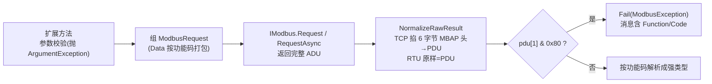

# 功能码扩展方法

<cite>
**本文引用的文件**
- [Junevy.Communication.Modbus/Extensions/ModbusExtensions.cs](file://Junevy.Communication.Modbus/Extensions/ModbusExtensions.cs)
- [Junevy.Communication.Modbus/Extensions/BinaryExtensions.cs](file://Junevy.Communication.Modbus/Extensions/BinaryExtensions.cs)
- [Junevy.Communication.Modbus/Extensions/LogExtensions.cs](file://Junevy.Communication.Modbus/Extensions/LogExtensions.cs)
- [Junevy.Communication.Modbus/Utils/ModbusHelper.cs](file://Junevy.Communication.Modbus/Utils/ModbusHelper.cs)
</cite>

命名空间 `Junevy.Communication.Modbus.Extensions`。`ModbusExtensions` 是 `IModbus` 的扩展方法集——**接入方 90% 的调用走这里**。每个方法都有同步 + 异步（`*Async`，多一个 `CancellationToken cancellationToken = default`）版本；异步全部返回 `ValueTask<...>`。

## 双层校验（重要行为差异）

| 层 | 参数不合法时 | 例子 |
|---|---|---|
| **扩展方法** | **抛 `ArgumentException`**（本地立刻，不发线上） | `ReadHoldingRegisters(slaveId, 0, 0)` → throw |
| **原始 `Request`/`RequestAsync`** | **返回 `Fail(InvalidRequest)`**（不抛） | `Request(new ModbusRequest{ Quantity=0 })` → Fail |

读类数量校验：线圈/离散输入 1–2000（`ValidateBitQuantity`）、寄存器 1–125（`ValidateRegisterQuantity`）；写多寄存器 1–123（`ValidateWriteRegisters`）；0x17 读 1–125 / 写 1–121；`PackCoils` 对 null/空/>1968 抛；`BuildDiagnosticsData` 对 data 0 或 >250 抛。**这与 `ModbusHelper.CheckRequest`（原始层，0x08 为 3–252 字节）阈值不同是有意设计**（审查修复 B9 对齐后仍分两层）。

## 方法清单（同步签名；异步同名 + Async）

| 方法 | 参数 | 返回 | 底层 FC |
|---|---|---|---|
| `ReadCoils` | slaveId, start, length | `ModbusResult<bool[]>` | 0x01 |
| `ReadDiscreteInputs` | slaveId, start, length | `ModbusResult<bool[]>` | 0x02 |
| `ReadHoldingRegisters` | slaveId, start, length | `ModbusResult<ushort[]>` | 0x03 |
| `ReadInputRegisters` | slaveId, start, length | `ModbusResult<ushort[]>` | 0x04 |
| `WriteSingleCoil` | slaveId, start, **bool** value | `ModbusResult<byte[]>`（回显 PDU） | 0x05 |
| `WriteSingleRegister` | slaveId, start, ushort value | `ModbusResult<byte[]>` | 0x06 |
| `ReadExceptionStatus` | slaveId | `ModbusResult<byte>`（取 PDU[2]） | 0x07 |
| `Diagnostics` | slaveId, subFunction, **ushort** 或 **byte[]** data | `ModbusResult<byte[]>` | 0x08 |
| `GetCommEventCounter` | slaveId | `ModbusResult<ModbusCommEventCounter>` | 0x0B |
| `GetCommEventLog` | slaveId | `ModbusResult<ModbusCommEventLog>` | 0x0C |
| `WriteMultipleCoils` | slaveId, start, **bool[]** values | `ModbusResult<byte[]>` | 0x0F |
| `WriteMultipleRegisters` | slaveId, start, **ushort[]** values | `ModbusResult<byte[]>` | 0x10 |
| `ReportServerId` | slaveId | `ModbusResult<byte[]>`（ByteCount 后的负载） | 0x11 |
| `MaskWriteRegister` | slaveId, start, andMask, orMask | `ModbusResult<byte[]>` | 0x16 |
| `ReadWriteMultipleRegisters` | slaveId, readStart, readLength, writeStart, ushort[] writeValues | `ModbusResult<ushort[]>` | 0x17 |

## 内部管线（理解返回值语义的关键）

- **写类返回的 `byte[]` 是回显 PDU**（SlaveId+FC+Start+…），不是"写入的数据"；通常只判 `IsSuccess`。
- `ParseCoils`/`ParseRegisters`（ModbusHelper）从 **PDU 偏移 3**（SlaveId、FC、ByteCount 之后）解数据，输入必须是 `NormalizeRawResult` 之后的 PDU。
- `WriteSingleCoil` 的 bool 映射：true → `0xFF,0x00`，false → `0x00,0x00`。
- `PackCoils` 位打包：第 i 位存 `data[i/8]` 的 `i%8` 位（低位在前），与 Modbus 规范一致。
- 0x17 的请求 Data 在扩展层完整组装（`BuildReadWriteMultipleRegistersData`），`StartAddress` 传 readStart、`Quantity` 传 readLength 供响应校验。
- 0x0B/0x0C 的解析对帧长有最小要求（Counter ≥6、Log ≥9），不足直接 Fail（不抛）。

## BinaryExtensions（字节序工具）

| 方法 | 说明 |
|---|---|
| `ushort.ToLittleEndian()` | 2 字节小端数组 |
| `ushort.ToBigEndian()` | 2 字节大端数组（Modbus 线上序） |
| `ushort[].ToBigEndianByteArray()` | 逐个 2 字节大端拼接 |
| `ushort[].ToHexString()` / `byte[].ToHexString()` | `"AA-BB-CC"` 形式（`BitConverter.ToString`） |

（2026-10-05 已删除易混淆的 `ToUshort(low, high)`，改用 `System.Buffers.Binary.BinaryPrimitives`。）

## LogExtensions（TX/RX hex 日志）

- `ToHex()`（byte[]/ReadOnlySpan）：16 字节一行的分组 hex。
- `ILogger.Tx(name, data, stopwatch, ref lastTimestamp)`：Debug 级 `[TX] [name] --> AA-BB...`。
- `ILogger.Rx(...)`：Debug 级 `[RX] [name] <-- AA-BB... (+{delta} ms)`——delta 是与上一次收发的时间差，用于现场估算从站响应时间。
- 传输层通过 `LogTx`/`LogRx` 包装（封装 stopwatch 状态），日志类别名为 `ModbusTcpClient`/`ModbusRtuClient`。

## 常见误用

- 把写类结果当数据用——写类 `Data` 是回显；拿数据请走读 API。
- 数量参数传 0 或超上限期望拿到 Fail——扩展层直接抛 `ArgumentException`（这属于编程错误，不是通信失败）。
- 给 `Diagnostics` 传 `ushort data` 时以为是原始值——它会被 `ToBigEndian()` 成 2 字节跟在 SubFunction 后。
