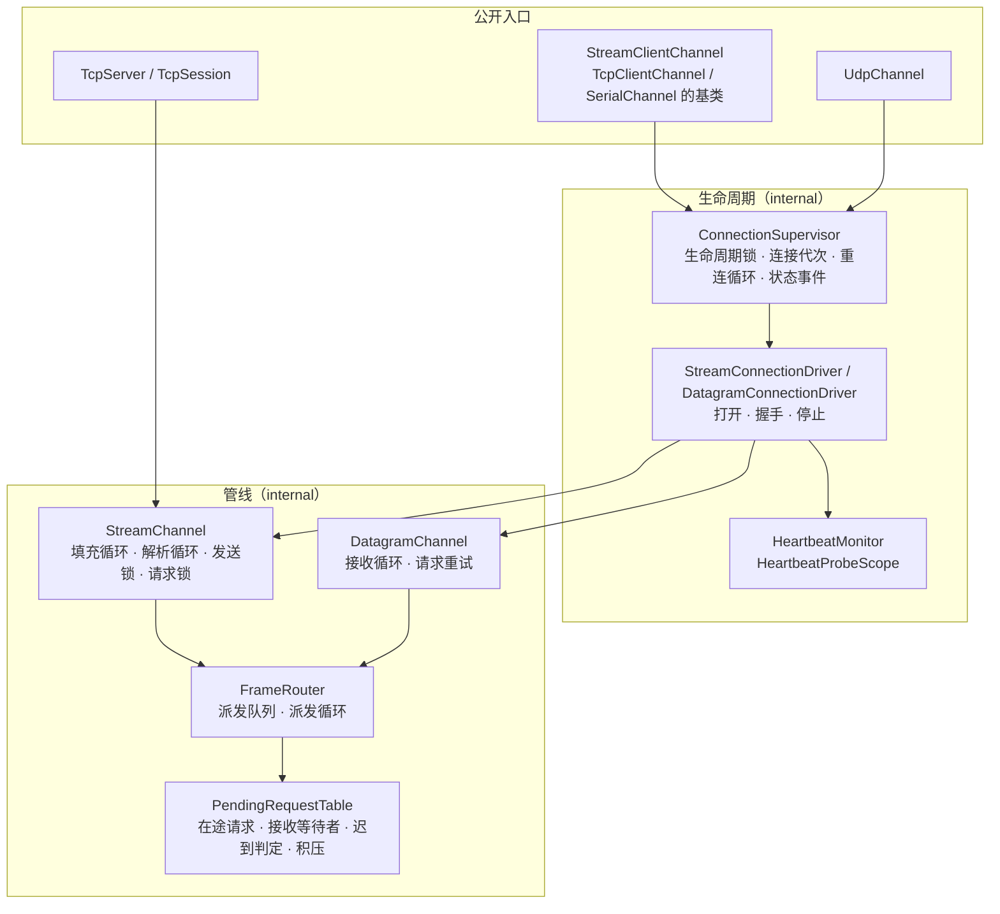
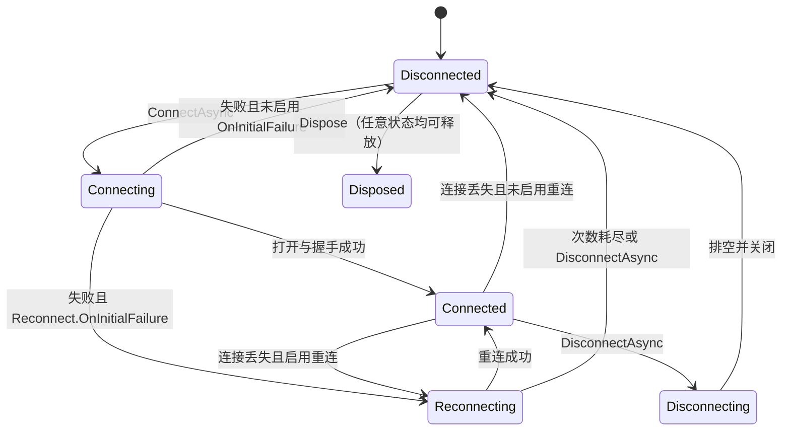
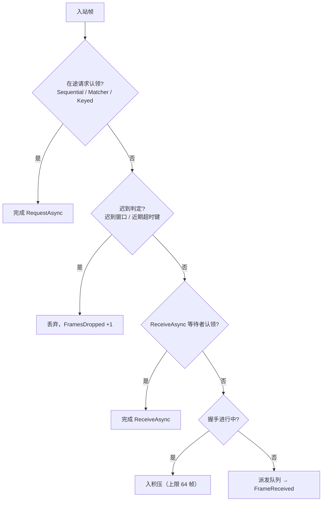
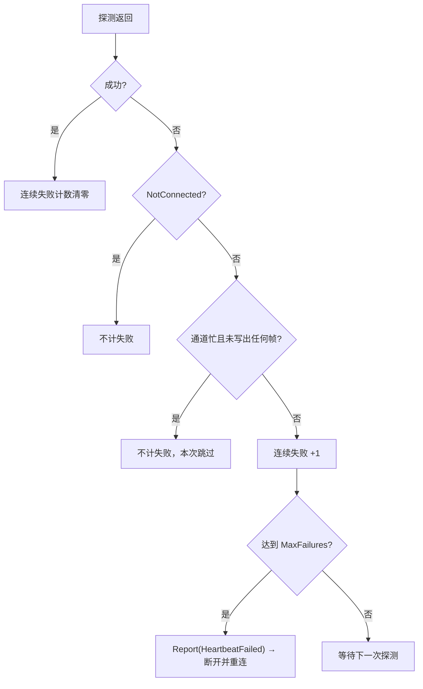

# 字节通道族内部结构

<cite>
**本文引用的文件**
- [Junevy.Communication.Channels/Lifecycle/StreamClientChannel.cs](file://Junevy.Communication.Channels/Lifecycle/StreamClientChannel.cs)
- [Junevy.Communication.Channels/Lifecycle/ConnectionSupervisor.cs](file://Junevy.Communication.Channels/Lifecycle/ConnectionSupervisor.cs)
- [Junevy.Communication.Channels/Lifecycle/StreamConnectionDriver.cs](file://Junevy.Communication.Channels/Lifecycle/StreamConnectionDriver.cs)
- [Junevy.Communication.Channels/Lifecycle/DatagramConnectionDriver.cs](file://Junevy.Communication.Channels/Lifecycle/DatagramConnectionDriver.cs)
- [Junevy.Communication.Channels/Lifecycle/HeartbeatMonitor.cs](file://Junevy.Communication.Channels/Lifecycle/HeartbeatMonitor.cs)
- [Junevy.Communication.Channels/Lifecycle/HeartbeatProbeScope.cs](file://Junevy.Communication.Channels/Lifecycle/HeartbeatProbeScope.cs)
- [Junevy.Communication.Channels/Lifecycle/PayloadHeartbeatProbe.cs](file://Junevy.Communication.Channels/Lifecycle/PayloadHeartbeatProbe.cs)
- [Junevy.Communication.Channels/Lifecycle/LifecycleSupport.cs](file://Junevy.Communication.Channels/Lifecycle/LifecycleSupport.cs)
- [Junevy.Communication.Channels/Pipeline/StreamChannel.cs](file://Junevy.Communication.Channels/Pipeline/StreamChannel.cs)
- [Junevy.Communication.Channels/Pipeline/FrameRouter.cs](file://Junevy.Communication.Channels/Pipeline/FrameRouter.cs)
- [Junevy.Communication.Channels/Pipeline/PendingRequestTable.cs](file://Junevy.Communication.Channels/Pipeline/PendingRequestTable.cs)
- [Junevy.Communication.Channels/Pipeline/DatagramChannel.cs](file://Junevy.Communication.Channels/Pipeline/DatagramChannel.cs)
- [Junevy.Communication.Tcp/Client/TcpClientChannel.cs](file://Junevy.Communication.Tcp/Client/TcpClientChannel.cs)
- [Junevy.Communication.Tcp/Server/TcpServer.cs](file://Junevy.Communication.Tcp/Server/TcpServer.cs)
- [Junevy.Communication.Udp/UdpChannel.cs](file://Junevy.Communication.Udp/UdpChannel.cs)
- [Junevy.Communication.Udp/UdpDatagramTransport.cs](file://Junevy.Communication.Udp/UdpDatagramTransport.cs)
- [docs/superpowers/specs/2026-10-10-communication-core-design.md](file://docs/superpowers/specs/2026-10-10-communication-core-design.md)
- [docs/superpowers/plans/2026-10-10-p1-communication-channels.md](file://docs/superpowers/plans/2026-10-10-p1-communication-channels.md)
</cite>

## 目录
1. [组件关系](#组件关系)
2. [ConnectionSupervisor](#connectionsupervisor)
3. [打开流程](#打开流程)
4. [StreamChannel：填充循环与解析循环](#streamchannel填充循环与解析循环)
5. [FrameRouter 与路由顺序](#framerouter-与路由顺序)
6. [DatagramChannel（UDP）](#datagramchanneludp)
7. [HeartbeatMonitor 与 HeartbeatProbeScope](#heartbeatmonitor-与-heartbeatprobescope)
8. [线程模型与背压](#线程模型与背压)
9. [TcpServer 会话建立顺序](#tcpserver-会话建立顺序)

## 组件关系

要点：

- 客户端的字节流通道（TCP、串口）经 `StreamClientChannel` 进入监督器；UDP 的 `UdpChannel` 直接组合监督器与数据报驱动，**不继承** `StreamClientChannel`。
- `TcpServer` 的每个会话直接持有一个 `StreamChannel`，不经过客户端的监督器。服务端的生命周期由 `TcpServer` 自己管理（见本页末节）。
- `FrameRouter` 与 `PendingRequestTable` 是字节流与数据报两种管线共用的路由部件。

## ConnectionSupervisor

`ConnectionSupervisor`（internal）拥有连接的生命周期，以下规则已在代码中固定：

- **生命周期锁**：`SemaphoreSlim(1, 1)` 串行化 Connect、Disconnect、重连尝试、连接丢失处理与释放。
- **状态锁与生命周期锁分离**：状态由 `stateSync` 保护。断线期间 `SendAsync` 等调用只读取状态，立即返回 `NotConnected`，不等待生命周期锁（`StreamClientChannel.ConnectedChannel()`）。
- **连接代次**：`generationCounter` 在每次连接建立时加 1。`ReportConnectionLost(generation, ...)` 只接受当前代次且状态为 `Connected` 的报告，旧 socket 迟到的异常不会打断新连接。打开期间的故障记入 `pendingLoss`，连接建立后按该代次处理；同一代次只调度一次（`lossScheduledGeneration`）。
- **连接丢失**：`HandleConnectionLostAsync` 在分离的后台任务中执行：取生命周期锁 → 复核代次 → 关闭驱动 → 启用重连且非用户断开时进入 `Reconnecting` 并启动循环，否则进入 `Disconnected`。
- **重连循环**：`RunReconnectLoopAsync` 每轮调用 `IBackoffPolicy.GetDelay(attempt)`。返回 `null`（超过 `MaxAttempts`）时进入 `Disconnected`，原因为 `ReconnectExhausted`；否则等待延时、取生命周期锁、执行一次 `OpenOnceAsync`，成功即结束。循环使用独立的取消源，`DisconnectAsync` 与 `DisposeAsync` 会取消并等待其退出。
- **用户断开**：`DisconnectAsync` 先在 `stateSync` 内置 `userDisconnected` 标记（之后不再创建新的循环），再取消并等待循环，然后取生命周期锁。`Connected` 时经 `Disconnecting` 关闭驱动（排空时限为 `DisconnectTimeout`）后进入 `Disconnected`（`UserRequested`）；`Reconnecting` 时直接进入 `Disconnected`（`UserRequested`）。
- **状态事件**：`SetStateLocked` 在状态锁内更新状态并写入一个无界、单读者的 `Channel`，保证事件顺序与状态变化顺序一致。派发任务在**首次状态变化时**才启动，它在锁外逐个调用订阅者；每个订阅者的异常被单独捕获并记日志（`LifecycleSupport.InvokeEach`）。
- **派发上下文标记**：派发期间设置 `AsyncLocal` 的 `DispatchScope`。`DisposeAsync` 在任何等待之前判断调用方是否位于状态事件处理器之内，据此决定要不要等待派发任务（见 [[行为契约/通道重连心跳与超时]] 的释放契约）。

状态转换图（与代码一致）：

## 打开流程

`StreamClientChannel` 的打开由 `StreamConnectionDriver.OpenAsync` 执行，顺序如下（与设计文档第 7.2 节和计划 9.3 节的修正一致）：

1. `OpenStreamAsync`：派生类打开传输并返回 `Stream`。TCP 由 `TcpConnector` 以 `ConnectTimeout` 连接；串口在 `OpenTimeout` 内打开。**握手时限从这一步完成之后才开始计时。**
2. 在 `HandshakeTimeout` 窗口内执行 `SecureStreamAsync`（TLS 认证；基类默认原样返回）。失败则中止传输。
3. `CreateConnection`：新建 `PendingRequestTable` 并调用 `BeginHandshake()`（之后未被认领的帧进入积压），再建 `FrameRouter`、`StreamChannel` 与连接对象。
4. `StreamChannel.Start()`：启动路由的派发循环、填充循环与解析循环。
5. 在同一窗口内执行 `IConnectionInitializer`（握手报文、登录等）。
6. `FrameRouter.EndHandshakeAsync()`：积压的帧按序进入派发队列。
7. 检查握手期间是否已发生故障；若有，本次打开失败。
8. 释放握手窗口，`StartHeartbeat`（仅在启用心跳或设置了空闲超时时），然后把连接设为当前连接并返回成功。

握手步骤的超时与取消都遵循同一规则：时限耗尽或用户取消后不再等待初始化器（它可能忽略取消令牌），但会观察它的异常，避免未观察的任务异常。

## StreamChannel：填充循环与解析循环

`StreamChannel`（internal）把 `Stream` 变成字节通道，采用两个循环（D7）：

- **填充循环**：每次向内部 `Pipe` 申请不少于 `ReceiveBufferSize`（`ClientChannelSettings` 默认 4096）的缓冲，从流读入其中。`Pipe` 的背压阈值为**暂停 1 MiB、恢复 512 KiB**：解析跟不上时填充循环挂起，形成对流的背压（TCP 由此触发流控）。
- **解析循环**：从 `PipeReader` 读出数据，经分帧器切出完整帧，交给 `FrameRouter.RouteAsync`。

**为什么不用 `PipeReader.Create(stream)`（D7）**：net472 的 `NetworkStream` 与 `SerialPort.BaseStream` 不响应取消令牌，`CancelPendingRead()` 也打断不了挂起的流读取，静默分帧与半帧计时会失效。内部 `Pipe` 的读端在 net472 与 net8.0 上都能可靠响应 `CancelPendingRead()`，因此计时与停止都作用在这个 `Pipe` 上。

**半帧计时**：缓冲中留有未成帧的数据时，`IdleTimer`（`System.Threading.Timer`）开始武装；超过 `PartialFrameTimeout` 没有新数据时，它调用 `CancelPendingRead()` 唤醒解析循环。此时：

- 若分帧器实现 `IFlushableFrameDecoder`（`IdleGap`），把残余数据整段交出；
- 否则按 `PartialFrameAction` 处理：`Disconnect`（TCP 默认）报告 `PartialFrameTimeout` 故障；`Discard`（串口固定）丢弃残余并计 `ProtocolErrors`。

**对端结束（EOF）与读取错误**：填充循环只记录结束原因并完成管道写端，不立即报告：读到 0 字节记为 `RemoteClosed`；`IOException` 记为 `RemoteClosed`；其他异常记为 `Error`。解析循环先处理完缓冲中的全部数据（可刷新分帧器整段交出；其余分帧器的残留半帧丢弃并计 `ProtocolErrors`），然后才报告记录的原因（计划 20.1 Task 6）。

**发送路径**：`sendLock` 串行化所有写出。编码后的整帧在 `SendTimeout` 内写出（`TimeoutScope`）。写出失败（超时、取消、I/O 错误）时，**先报告 `SendFailed`，再中止传输**，避免读取端抢先以 `RemoteClosed` 报告、掩盖真正的原因。取消正在写出的帧同样断开连接，因为可能已写出半帧（D10）；取消发生在等待发送锁期间则只返回 `Cancelled`。

**请求路径**：

1. Sequential 模式先取请求锁。等待锁的时间不计入 `RequestTimeout`。
2. 先在表中登记等待者，再写出帧（避免错过应答）。
3. 写出完成后才启动超时计时器。
4. 等待结果。Sequential 模式下超时或取消时，由 `HoldRequestLockAfterExpiryAsync` 决定：启用 `ResetOnRequestTimeout` 且不在心跳探测中时报告 `RequestTimeout` 故障（连接重建）；否则在迟到窗口内继续持有请求锁。

**故障报告**：`Fault` 对同一实例至多执行一次。它先以 `ConnectionClosed` 完成所有在途等待者，再调用 `onFault`。`StreamChannel` 报告故障后**不会自行停止**，由监督器停止它；`onFault` 中不得同步等待停止完成（计划 20.1 Task 6）。停止过程中的任何故障都不报告。

**停止顺序**（`PerformStopAsync`）：中止传输 → 取消内部停止源 → 完成管道写端并取消挂起的读取 → **先启动路由的停止**（允许从 `FrameReceived` 处理器内发起停止，此时只有路由停止才能让解析循环退出）→ 在时限内等待两个循环退出 → 以 `ConnectionClosed` 结束所有在途等待者 → 等待路由停止。

## FrameRouter 与路由顺序

`FrameRouter`（internal）对每个入站帧执行固定顺序的判定，由 `PendingRequestTable.TryComplete` 与 `ClassifyUnclaimed` 实现：

各步骤的细节：

- **在途请求认领**：`Sequential` 只有一个在途请求；`Matcher` 按注册顺序逐个调用 `IResponseMatcher.IsMatch`；`Keyed` 按关联键字典查找。三者都先比对来源地址（数据报的 `SourceMatches`）。
- **迟到判定**：`Sequential` 判断当前时刻是否早于迟到窗口的截止时刻；`Keyed` 判断是否命中近期超时的关联键（最多记录 256 个，超出时淘汰最早过期的键）；`Matcher` 无法识别迟到应答，不做判定。命中时记 Warning 并丢弃。
- **接收等待者**：`ReceiveAsync` 登记的是空负载的等待者，所有关联模式都使用 `Matcher` 判定。它在登记时先扫描积压（`FindBacklogIndex`）。
- **握手积压**：握手进行中未被认领的帧入积压，上限 `PendingRequestTable.MaxHandshakeBacklog`（64 帧）。溢出时字节流抛出 `FrameDecodeException`，按 `ProtocolViolation` 处理（TCP 断开；串口丢弃残余）。
- **派发队列**：有界 `Channel`，容量为 `ReceiveQueueCapacity`（默认 1024）。派发循环是单读者，逐帧在 `DispatchScope` 内调用订阅者；订阅者的异常被捕获并记日志，循环继续。

应答在第 1 步直接完成，**不经过派发队列**，因此慢的 `FrameReceived` 处理器不会延迟应答的交付。但队列满且为 `Wait` 模式时，`RouteAsync` 会阻塞解析循环，此时后续的帧（包括应答）都要等待（设计第 5.3 节）。

**队列满的三种策略**：

| `QueueFullMode` | 行为 | 默认用于 |
|---|---|---|
| `Wait` | 解析循环阻塞，经内部 `Pipe` 与 TCP 流控形成端到端背压 | TCP 客户端、服务端会话、`ClientChannelSettings` 基类 |
| `DropOldest` | 丢弃队列中最旧的帧，计入 `FramesDropped`，每 100 帧记一次 Warning（`DropWarningInterval`） | 串口、UDP（没有流控） |
| `DropNewest` | 映射为 `BoundedChannelFullMode.DropWrite`，丢弃**新到的**帧；不移除队列中已入队的帧 | 仅显式配置 |

`DropNewest` 没有直接映射到 `BoundedChannelFullMode.DropNewest`，因为后者会移除队列中最新的已入队帧（`FrameRouter.MapFullMode` 的注释）。

**停止**：`StopAsync(drainTimeout)` 在普通路径下完成写端，并最多等待 `drainTimeout` 毫秒排空已收到的帧；超时后取消派发循环，剩余帧计入 `FramesDropped` 并记 Warning。重复调用等待同一次停止。在派发上下文内调用（即从 `FrameReceived` 处理器内发起）时只发出停止信号、不等待，因此不会死锁（D16）。这一路径下队列中尚未派发的帧会被直接丢弃，而不是排空。

## DatagramChannel（UDP）

`DatagramChannel`（internal）与具体套接字无关，经内部的 `IDatagramTransport` 收发数据报，只有 `Junevy.Communication.Udp` 的 `UdpDatagramTransport` 接触 `UdpClient`。

- **不分帧**：每个数据报直接成为一帧，并携带来源地址交给路由（`RouteAsync(data, remote, ...)`）。
- **接收循环**是单个任务。每个数据报的处理顺序：
  1. 定向模式下，来源不等于远端 → 丢弃，计 `FramesDropped`（不断开）。过滤在代码中完成，不调用 `Socket.Connect`（D13）。
  2. 长度大于 `MaxDatagramSize` → 丢弃，计 `ProtocolErrors`（不断开；无法检测截断）。
  3. 其余交给 `FrameRouter`。握手积压溢出时，**丢弃该数据报并计 `ProtocolErrors`，不断开**。这与字节流不同：设计第 11.1 节把"积压溢出按 ProtocolViolation 处理"写成了所有客户端通道的通用规则，数据报通道的实际行为以代码为准。
- **请求**：每次尝试单独计时（`RequestTimeout`）。超时后按 `RequestRetryCount` 原样重发，每次重发重新计时。全部尝试超时后，等待者被移出表并登记迟到窗口。发送失败立即返回，不进入迟到窗口。
- **请求超时不重建连接**，由迟到窗口处理；**发送失败**仍报告 `SendFailed` 并断开（启用重连时重新绑定套接字）。

`UdpDatagramTransport` 的套接字打开顺序（计划 15.2）为：`SO_REUSEADDR` → 接收缓冲 → 绑定 → 广播 → 组播回环与 TTL → 加入组播组 → `SIO_UDP_CONNRESET`。`SIO_UDP_CONNRESET` 用于关闭"向无人监听的端口发送后，接收抛出 10054"的行为，否则接收循环会被打断。net472 恒执行；net8.0 仅在 Windows 上执行，因为其他平台不支持该控制码。

## HeartbeatMonitor 与 HeartbeatProbeScope

`HeartbeatMonitor`（internal）是每条连接一个的单任务循环。它同时负责两件事：

- **空闲检测**（`IdleTimeout > 0`）：超过阈值没有入站帧时 `Report(IdleTimeout)`。
- **心跳探测**（`Heartbeat.Enabled`）：

循环的唤醒间隔不超过 250 ms（`MaxWakeMilliseconds`），避免长时间休眠错过截止时间。探测调度的规则：

- 首次探测在监视器启动后一个 `Interval` 发出；之后按**起始时刻**调度（start-to-start）。若 `Timeout` 大于 `Interval`，上一次探测结束后下一次会立即开始。
- `OnlyWhenIdle` 为真时，若上一次采样之后有收发流量，本次探测跳过（不计失败）。探测自身的收发不计为业务流量，探测结束后重新采样。

探测在 `HeartbeatProbeScope.Enter()` 的同步部分内挂接到执行流上，并使用一个带超时的 linked 取消源。超时后取消探测，结果判为超时失败。

`HeartbeatProbeScope`（internal）记录两个事实：探测是否**进入了通道操作**（`NoteChannelOperation`，发送与请求开始时调用）和是否**真正开始写出**（`NoteWriteStarted`）。`ChannelBusy = 进入过通道操作 && 未开始写出`，即探测排在请求锁或发送锁上直到超时、一帧都没写出。

探测结果的判定：

**探测上下文的作用**：探测期间 Sequential 请求的超时不会触发 `ResetOnRequestTimeout` 重建连接（`HoldRequestLockAfterExpiryAsync` 检查 `HeartbeatProbeScope.IsActive`），失败由监视器按 `MaxFailures` 计数。否则第一次探测超时就会断开连接，`MaxFailures` 失效（计划 20.1 Task 8）。已知限制：上下文随探测代码的异步调用链流动，探测代码若调用了**其他**通道的请求，那些请求同样不会触发重建。协议探测只访问本通道，可以接受。

**内置探测**（`PayloadHeartbeatProbe`）：未设置 `ExpectedReply` 时，`SendAsync` 成功即健康（只适用于 TCP）；设置后用 `RequestAsync` 发送并比较整帧的每个字节（`SequenceEqual`，D14）。不相等返回 `ProtocolViolation`，计为失败。

## 线程模型与背压

每条字节流连接的常驻任务：

- 填充循环、解析循环、派发循环（三个任务，由 `StreamChannel.Start()` 启动）；
- 心跳监视循环（启用心跳或设置空闲超时时）；
- 重连循环（仅在重连期间存在）；
- 状态事件派发任务（首次状态变化时启动）。

数据报连接：接收循环、派发循环、心跳循环（按需）。后台任务由 `LifecycleSupport.StartDetached`（使用 `ExecutionContext.SuppressFlow`）或 `Task.Run` 启动，因此调用方的 `AsyncLocal` 不会流入这些循环。心跳探测上下文是例外，它在探测启动时显式挂接。

- **事件线程**：`StateChanged`、`FrameReceived` 与服务端事件都在线程池线程上触发。库内部的 `Pipe` 使用 `useSynchronizationContext: false`，不切回原同步上下文。WPF 界面需要自行切回 Dispatcher（见 Skill `using-junevy-channels`）。
- **背压**：TCP 默认 `QueueFullMode.Wait`，形成端到端背压：派发队列满 → 解析循环阻塞 → 内部 `Pipe` 积累到 1 MiB → 填充循环等待 → TCP 流控让对端放慢。串口与 UDP 没有流控，默认 `DropOldest`，溢出的帧计入 `FramesDropped`。
- **异步约定**：库内每个 `await` 都使用 `ConfigureAwait(false)`（计划第 1 节第 4 条）。

## TcpServer 会话建立顺序

`TcpServer`（sealed）的接受循环与会话管理都在本类内实现，不经过 `ConnectionSupervisor`。

**接受循环检查**（在服务端锁之外调用用户的过滤器）按以下顺序：停止中 → `MaxSessions`（0 表示不限）→ `AllowedRemoteAddresses`（IP 字面量比较）→ `TcpChannelComponents.ConnectionFilter`（抛异常视为拒绝）。不通过的连接立即关闭，记 Warning，不触发任何会话事件。

**每个会话**（`RunSessionAsync`，后台任务）按以下顺序建立：

1. 应用套接字选项（`TcpSocketConfigurator`）。
2. 在 `SessionHandshakeTimeout` 总时限内完成握手：启用 TLS 时先做 TLS 认证；然后创建关联表与路由，调用 `BeginHandshake()`，启动会话的 `StreamChannel`，最后执行 `IConnectionInitializer`。
3. 加入会话表，并排队 `SessionConnected`（两者在同一临界区内完成，保证拆除只能在加入之后排队 `SessionClosed`）。
4. 等待 `SessionConnected` 派发完成。这保证该会话的任何 `FrameReceived` 都不会早于 `SessionConnected` 的处理器。
5. `EndHandshake()` 释放握手积压。
6. 启动会话心跳。

握手失败或超时只关闭会话，**不触发任何会话事件**。会话的故障（对端关闭、读写异常、心跳失败、空闲超时、协议违规）在后台拆除会话，同一会话只拆除一次。

**服务端事件**（`StateChanged`、`SessionConnected`、`SessionClosed`）经单个派发循环按顺序、在锁外触发。会话的 `FrameReceived` 在路由的派发循环中触发，先触发会话级订阅者，再触发服务端级订阅者。在事件处理器内调用 `StopAsync` 或会话的 `CloseAsync` 只发出信号、不等待，因此不会死锁（D16）。

**会话心跳**：优先使用 `TcpChannelComponents.SessionHealthProbeFactory`，它为每个会话创建一个专用探测；未设置工厂时，启用心跳则使用绑定到该会话的内置负载探测，此时必须设置 `Heartbeat.Payload`。把 `ChannelComponents.HealthProbe` 传给服务端会在构造时抛出 `ArgumentException`，因为同一个探测实例无法绑定到单个会话（计划 20.1 Task 9）。

> [!note] 与设计文档的对应
> 本页的行为以代码为准。设计文档第 6 节的原始描述与实现的差异（如 `IConnectionDriver` 的签名、字节流的循环数量、会话接入顺序）见设计文档第 20.1 节的实施修订表（第 13、15、17 项）。数据报的积压溢出行为见上文 DatagramChannel 一节。
