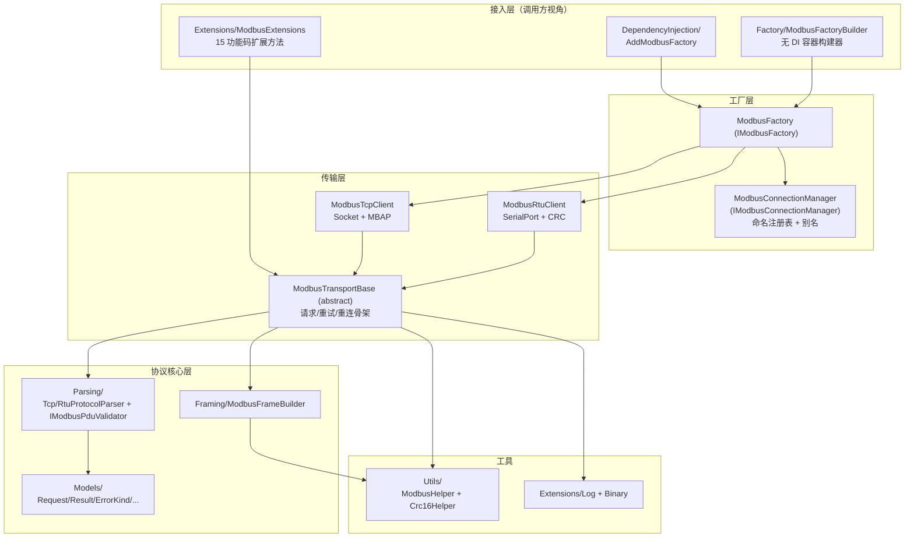

# 整体架构概览

<cite>
**本文引用的文件**
- [Junevy.Communication.Modbus/Core/Transports/ModbusTransportBase.cs](file://Junevy.Communication.Modbus/Core/Transports/ModbusTransportBase.cs)
- [Junevy.Communication.Modbus/Tcp/ModbusTcpClient.cs](file://Junevy.Communication.Modbus/Tcp/ModbusTcpClient.cs)
- [Junevy.Communication.Modbus/Rtu/ModbusRtuClient.cs](file://Junevy.Communication.Modbus/Rtu/ModbusRtuClient.cs)
- [Junevy.Communication.Modbus/Core/Parsing/TcpProtocolParser.cs](file://Junevy.Communication.Modbus/Core/Parsing/TcpProtocolParser.cs)
- [Junevy.Communication.Modbus/Core/Parsing/RtuProtocolParser.cs](file://Junevy.Communication.Modbus/Core/Parsing/RtuProtocolParser.cs)
- [Junevy.Communication.Modbus/Factory/ModbusFactory.cs](file://Junevy.Communication.Modbus/Factory/ModbusFactory.cs)
- [Junevy.Communication.Modbus/DependencyInjection/ModbusServiceCollectionExtensions.cs](file://Junevy.Communication.Modbus/DependencyInjection/ModbusServiceCollectionExtensions.cs)
</cite>

## 目录
1. [分层与依赖方向](#分层与依赖方向)
2. [各层职责](#各层职责)
3. [关键设计决策](#关键设计决策)
4. [扩展点](#扩展点)

## 分层与依赖方向

依赖单向向下：`Tcp/Rtu` → `Core` → `Utils`；工厂层只依赖 `Core.Interfaces` 与具体客户端。测试与 WPF 示例在最外层。

## 各层职责

| 位置 | 类型 | 职责 |
|---|---|---|
| `Tcp/`、`Rtu/` | `ModbusTcpClient` / `ModbusRtuClient`（sealed） | **只做协议差异**：连接建立/关闭（Socket / SerialPort）、帧收发（MBAP 分帧 / Read-until-frame）、配置转发、日志文本 |
| `Core/Transports/` | `ModbusTransportBase`（abstract） | **协议无关骨架**：`IModbus` 全部公开 API、重试循环（同步+异步各一份）、懒重连、请求锁串行化、事务 ID 分配、Dispose 模板。TCP/RTU 原各持四份近似重试循环，2026-10-05 合并为一（两文件 1233 行 → 752 行） |
| `Core/Interfaces/` | `IModbus`、`IModbusConfig`、`IModbusFrameBuilder`、`IResponseParser` | 契约。`IModbus` 是所有客户端/扩展方法的公共接口 |
| `Core/Framing/` | `ModbusFrameBuilder` | 请求帧构建（TCP 加 MBAP 头 / RTU 加 CRC 尾），协议作为**显式参数**传入，不读 `request.ProtocolType` |
| `Core/Parsing/` | `TcpProtocolParser`、`RtuProtocolParser`、`ModbusPduValidator` | **解帧与 PDU 校验分离（2026-10-08）**：两个解析器只做帧边界（TCP 的 MBAP / RTU 的扫描+CRC），PDU 语义交给 `IModbusPduValidator`。解析器实现 `IResponseParser`、校验器实现 `IModbusPduValidator`，两者都可注入替换 |
| `Core/Models/` | `ModbusRequest`、`ModbusResult<T>`、`ModbusErrorKind`、`ModbusFunctionCode`、`ModbusException(Code)` 等 | 纯数据模型（DTO 无事件、无行为） |
| `Factory/` | `ModbusFactory`、`ModbusConnectionManager`、`ModbusFactoryBuilder`、`IModbusClientCreator` / `TcpClientCreator` / `RtuClientCreator` | 命名连接的创建/注册表/别名/生命周期。**工厂策略化（2026-10-08）**：客户端创建经 `IModbusClientCreator` 按配置类型解析，新增传输无需改工厂 |
| `DependencyInjection/` | `ModbusServiceCollectionExtensions` | `AddModbusFactory()` 一行注册（全部 `TryAddSingleton`，工厂与连接管理器**共享同一注册表**） |
| `Extensions/` | `ModbusBitExtensions`、`ModbusRegisterExtensions`、`ModbusDiagnosticsExtensions`（公开）；`ModbusRequestExecutor`、`ModbusPayloadCodec`（internal） | 用户侧便捷 API 与字节序/hex 日志工具。按功能码组拆成三个公开静态类（2026-10-08），命名空间不变；执行核心与负载编解码下沉到两个 internal 类 |
| `Utils/` | `ModbusHelper`、`Crc16Helper` | 请求校验（`CheckRequest`）、线圈/寄存器解析、CRC16/MODBUS |

## 关键设计决策

1. **模板方法去重**：`ModbusTransportBase` 持有"校验 → 锁 → TID → EnsureConnected → Send → Receive → 分类 → 重试"完整骨架；子类实现 10 个抽象钩子（连接开/关/失效/收发 ×同步异步、配置转发、`AssignsTransactionId`）+ 4 个可选虚钩子（消息文本、`CreateInvalidRequestResult`、`RequiresNewConnection`、`LogRequestStarted`）。钩子表详见 [[API参考/核心接口与传输基类]]。
2. **库不篡改调用者对象**：帧构建的协议来自显式参数而非 `request.ProtocolType`（有测试 `FrameBuilder_ProtocolComesFromArgumentNotRequest` 固定）；唯一例外是 TCP 客户端在锁内回写自增 `TransactionId`（响应匹配必需）。注意：`GetOrAdd/TryAdd` 会**改写 config 对象**的非法/零值字段（填充默认值），这与"不改请求"是两回事，见 [[Agent协作/常见陷阱与易错点]]。
3. **错误契约统一**：失败一律 `ModbusResult.Fail(msg, ErrorKind)`，是否需要新连接基于 `ErrorKind`（`RequiresNewConnection`）而非消息字符串；`ErrorKind` **逐层透传**到扩展方法层，调用方拿到什么 Kind 取决于从站实际发生了什么。Modbus 异常响应（FC|0x80）在解析器层即判终态，逐层透传。
4. **同步 + 异步双轨**：`Request`/`RequestAsync`、`Connect`/`ConnectAsync` 公开 API 成对存在；骨架内部也是同步/异步各一份实现（不共享代码，因为 net472 异步降级路径不同）。
5. **缓冲复用**：收发帧用 `ArrayPool<byte>.Shared` 租借（TCP `MaxTcpAduLength=260`、RTU `MaxRtuAduLength=256`）。

## 扩展点

| 扩展点 | 注入方式 | 用途 |
|---|---|---|
| `IResponseParser` | 客户端第 3 构造参数 / 工厂 `WithTcpParser`、`WithRtuParser` | 改写解帧逻辑（帧边界定位），适配非标准从站的帧格式 |
| `IModbusPduValidator` | `new TcpProtocolParser(validator, logger)` / DI 注册 | 改写 PDU 语义校验（功能码、字节数、回显字段），不放宽/收紧单条规则 |
| `IModbusClientCreator` | DI 中 `AddSingleton`（**必须在 `AddModbusFactory()` 之后**）/ 工厂 `WithCreator` | 新增一种传输（配置类型 + 创建器），工厂无需改动 |
| `IModbusFrameBuilder` | 客户端第 4 构造参数 / DI / 工厂 | 自定义请求帧（如厂商私有功能码） |
| `IModbusConnectionManager` | DI 单独注册 / 工厂 `WithConnectionManager` | 与宿主容器共享连接注册表 |
| `ILoggerFactory` | DI / 工厂 `WithLoggerFactory` | 全链路日志（客户端、工厂、管理器各自的 `ILogger<T>`） |

新增传输方式（如 Modbus TCP over UDP、ASCII）的推荐路径：继承 `ModbusTransportBase` 实现钩子（不要复制重试循环），再实现 `IModbusClientCreator` 让工厂能创建它。
