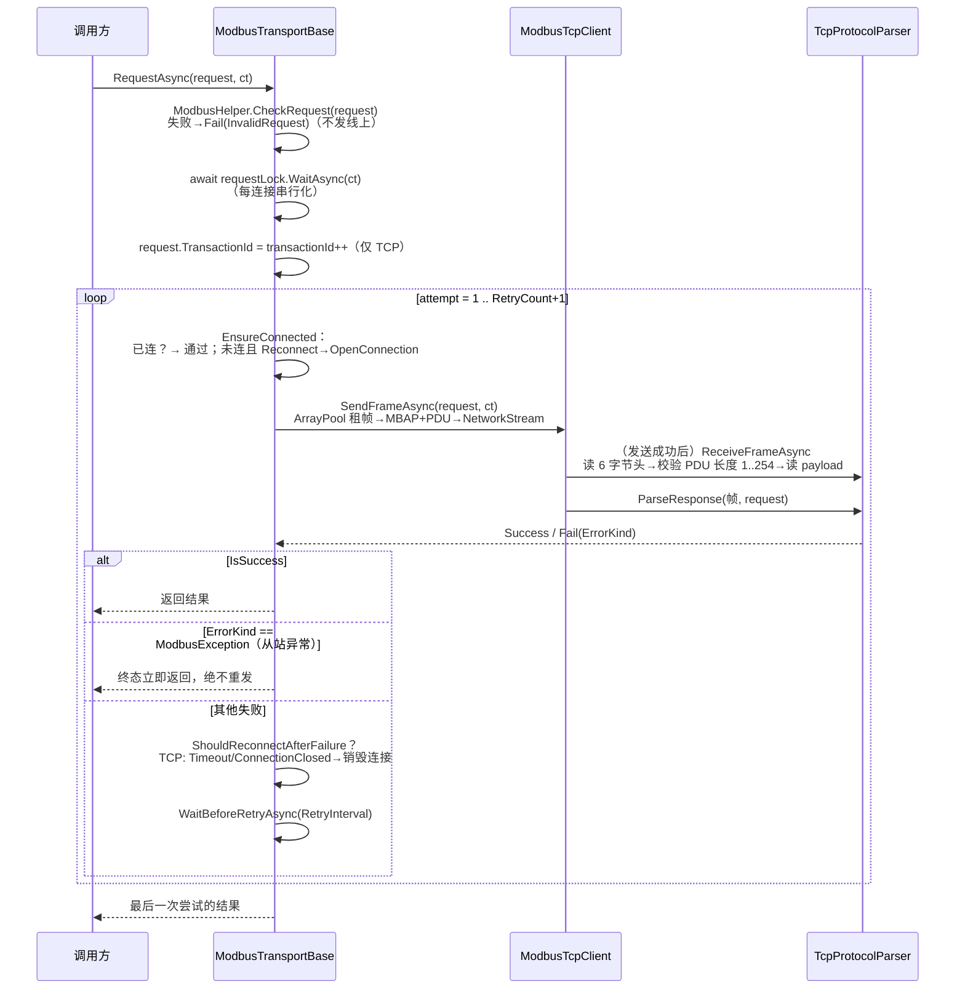

# 请求生命周期

<cite>
**本文引用的文件**
- [Junevy.Communication.Modbus/Core/Transports/ModbusTransportBase.cs](file://Junevy.Communication.Modbus/Core/Transports/ModbusTransportBase.cs)
- [Junevy.Communication.Modbus/Tcp/ModbusTcpClient.cs](file://Junevy.Communication.Modbus/Tcp/ModbusTcpClient.cs)
- [Junevy.Communication.Modbus/Rtu/ModbusRtuClient.cs](file://Junevy.Communication.Modbus/Rtu/ModbusRtuClient.cs)
- [Junevy.Communication.Modbus/Utils/ModbusHelper.cs](file://Junevy.Communication.Modbus/Utils/ModbusHelper.cs)
- [Junevy.Communication.Modbus/Extensions/ModbusExtensions.cs](file://Junevy.Communication.Modbus/Extensions/ModbusExtensions.cs)
</cite>

## 目录
1. [总时序](#总时序)
2. [各阶段细节](#各阶段细节)
3. [失败路径](#失败路径)

## 总时序

以 `await client.RequestAsync(request, ct)`（TCP，`Reconnect=true`）为例：

RTU 差异：无 TID 分配（`AssignsTransactionId=false`）；发送前 `DiscardInBuffer/DiscardOutBuffer`；接收是 **Read-until-frame 循环**——每读一段就尝试解析，不足 5 字节继续读，未匹配成功等 `FrameReadInterval`（默认 30ms）再读，直到解析出 CRC 正确的完整帧或超时。

## 各阶段细节

### 1. 本地校验（不发线上）

`ModbusHelper.CheckRequest(request)`（Utils/ModbusHelper.cs）按功能码校验：数量范围（线圈 1–2000、寄存器读 1–125、写 1–123 等）、`Data` 长度与功能码匹配（单写恰好 2 字节、掩码写 4 字节、0x0F/0x10 与数量精确对应、0x08 为 3–252 字节、0x17 ≥9 字节且内部自洽）。失败返回 `Fail(..., InvalidRequest)`，**扩展方法层**则先行抛 `ArgumentException`（两层行为不同，见 [[API参考/功能码扩展方法]]）。

### 2. 请求锁

`SemaphoreSlim(1,1)` 实例字段 `requestLock`。**Connect / Disconnect / Request / RequestAsync 全部经同一把锁**——消除"连接重建与在途请求交错"的竞态（有并发测试固定）。锁内调用子类钩子均为无锁核心（`OpenConnection` 等），避免重入死锁。

### 3. 事务 ID（仅 TCP）

`AssignsTransactionId=true`：每个**逻辑请求**（含其全部重试）在锁内分配一个自增 `ushort`（从 0 开始，回绕），写入 `request.TransactionId`；解析器按**精确相等**匹配响应 TID（`TcpParser_TransactionIdMustMatchExactly`），晚到旧响应永不错配。RTU 无此概念。

### 4. EnsureConnected（懒重连）

已连接 → 直接继续。未连接且 `Reconnect=true` → 日志后调用无锁 `OpenConnection`（TCP 重建 Socket 握手 / RTU 重开串口）；`Reconnect=false` → 返回 `Fail(NotConnected, ConnectionClosed)`。**没有后台看门狗**，重连只发生在请求路径上。

### 5. 收发与解析

TCP：`TryWriteRequestFrame` 写入租借缓冲 → 循环 send → 读 6 字节 MBAP 头 → PDU 长度合法性（1–254，违规即 `ProtocolViolation`）→ 读 payload → 解析器校验 PID/TID/UID/帧长 → 返回整帧。RTU：见上。发送失败 → `InvalidateConnection()` 销毁连接（TCP 释放 socket / RTU 关串口），归类 `ConnectionClosed`。

### 6. 结果归一化

原始 `Request` 返回**完整 ADU**（TCP 含 MBAP 头、RTU 含 CRC 尾）。扩展方法层 `NormalizeRawResult` 再剥离：TCP 掐头 6 字节、RTU 保持原样，得到 PDU（SlaveId+FC+...），并二次检测异常位（`pdu[1] & 0x80`）→ `Fail(ModbusException)`；随后按功能码解析成强类型（`ParseCoils`/`ParseRegisters` 从 PDU 偏移 3 起解）。

## 失败路径

| 阶段失败 | 结果 | 是否重试 | 是否重连 |
|---|---|---|---|
| 本地校验不过 | `Fail(InvalidRequest)` | 否 | 否 |
| EnsureConnected 失败 | `Fail(NotConnected, ConnectionClosed)` | 是（等 RetryInterval） | 已尝试过 |
| 发送失败 | `Fail(Send failed, ConnectionClosed)` | 是 | 是（销毁连接） |
| 读超时 | `Fail(Timeout)` | 是 | TCP 是（`ShouldReconnectAfterFailure`） |
| 帧违规 / CRC 失败 | `Fail(ProtocolViolation)` | 是 | TCP 仅 Timeout/ConnectionClosed 才重建 |
| 从站 Modbus 异常（FC|0x80） | `Fail(ModbusException, 消息含 Code=0xXX)` | **否（终态）** | 否 |
| 用户取消 | `Fail(Cancelled)` | 否 | 否 |

重试总尝试次数 = `RetryCount + 1`（`GetAttemptCount` 中 `Math.Max(1, ...)` 兜底）；全部失败时返回**最后一次**结果。同步/异步两份循环行为对齐（有测试固定同步异步一致性）。

唯一可能**抛异常**出 `Request` 的情形：通信异常类型之外的内层异常（如代码缺陷抛出的 `NullReferenceException`）不被吞掉；通信异常类型白名单见 [[行为契约/错误处理与错误分类]]。
