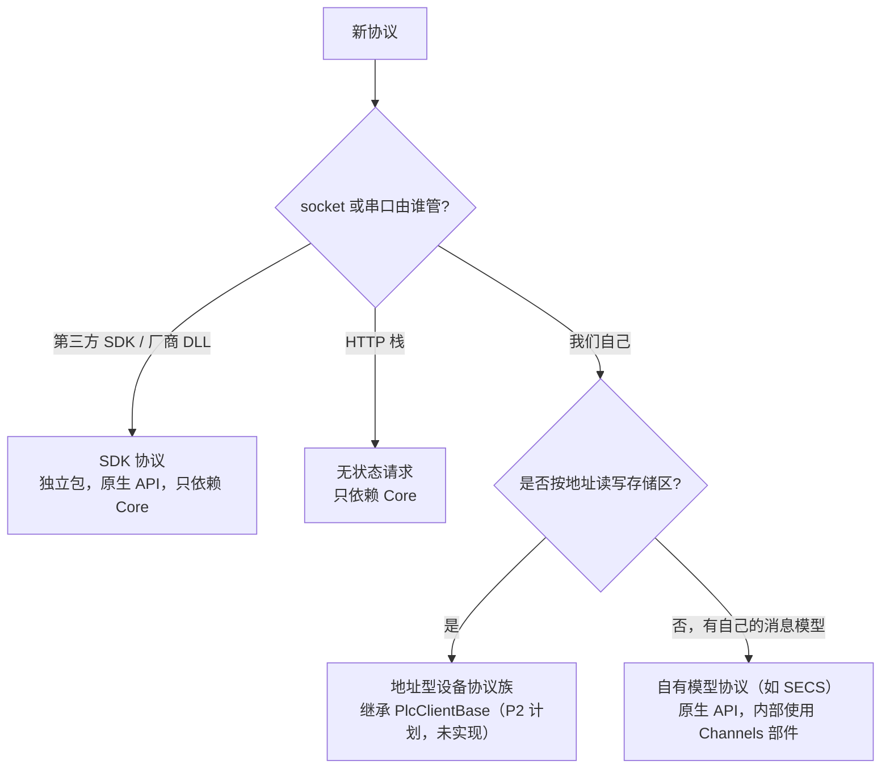
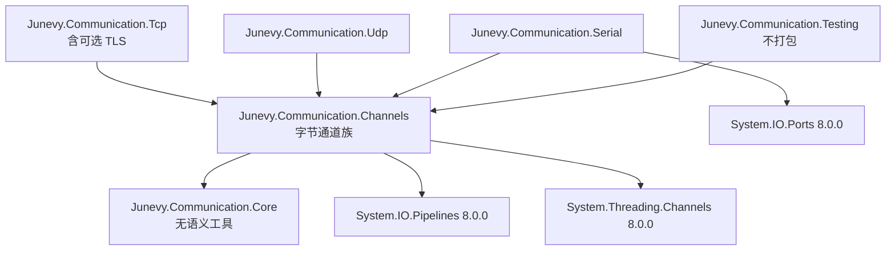

# 通讯库总体架构（协议族）

<cite>
**本文引用的文件**
- [docs/superpowers/specs/2026-10-10-communication-core-design.md](file://docs/superpowers/specs/2026-10-10-communication-core-design.md)
- [docs/superpowers/plans/2026-10-10-p1-communication-channels.md](file://docs/superpowers/plans/2026-10-10-p1-communication-channels.md)
- [build/Junevy.Communication.Common.props](file://build/Junevy.Communication.Common.props)
- [build/Junevy.Communication.Tests.props](file://build/Junevy.Communication.Tests.props)
- [Junevy.Communication.Core/Junevy.Communication.Core.csproj](file://Junevy.Communication.Core/Junevy.Communication.Core.csproj)
- [Junevy.Communication.Channels/Junevy.Communication.Channels.csproj](file://Junevy.Communication.Channels/Junevy.Communication.Channels.csproj)
- [Junevy.Communication.Tcp/Junevy.Communication.Tcp.csproj](file://Junevy.Communication.Tcp/Junevy.Communication.Tcp.csproj)
- [Junevy.Communication.Udp/Junevy.Communication.Udp.csproj](file://Junevy.Communication.Udp/Junevy.Communication.Udp.csproj)
- [Junevy.Communication.Serial/Junevy.Communication.Serial.csproj](file://Junevy.Communication.Serial/Junevy.Communication.Serial.csproj)
- [Tests/Junevy.Communication.Testing/Junevy.Communication.Testing.csproj](file://Tests/Junevy.Communication.Testing/Junevy.Communication.Testing.csproj)
- [Junevy.Communication.Modbus/Junevy.Communication.Modbus.csproj](file://Junevy.Communication.Modbus/Junevy.Communication.Modbus.csproj)
</cite>

## 目录
1. [协议族划分](#协议族划分)
2. [共享实现，不共享语义](#共享实现不共享语义)
3. [新协议归类指引](#新协议归类指引)
4. [包依赖规则](#包依赖规则)
5. [与 Modbus 的关系](#与-modbus-的关系)
6. [分期与当前状态](#分期与当前状态)

## 协议族划分

通讯库按**协议族**组织。族内共享接口与骨架，新协议继承骨架、只写协议差异；族间只共享没有语义的工具（结果分类、退避、命名注册表、超时工具、十六进制格式化）。

| 协议族 | 成员 | 族内共享什么 | 对外 API | 状态 |
|---|---|---|---|---|
| 字节通道族 | TCP（含可选 TLS）、UDP、串口 | 连接生命周期、分帧、请求-应答关联、心跳、重连、超时 | `IClientChannel` / `IByteChannel`（以及 `TcpServer` 的会话） | P1 已实现 |
| 地址型设备协议族 | MELSEC MC、S7、欧姆龙 FINS、Modbus（v3 迁移后） | 请求管线、类型化读写、地址解析、拆包、字节序；建立在字节通道族之上 | 设计为 `IPlcClient` 与类型化扩展方法 | 设计，P2 起（Plc 套件） |
| SECS | HSMS、SECS-I、GEM | 内部复用字节通道族的实现 | 原生 SECS-II 消息、HSMS 与 GEM 状态 | 设计，P5 |
| SDK 协议 | OPC UA、MQTT、FTP、厂商 DLL | 只使用 Core 工具 | 原生，保留各 SDK 的模型 | 设计，P6 |
| 无状态请求 | WebAPI（REST、SOAP）、HTTP 服务端 | 只使用 Core 工具 | 原生 HTTP 语义（`WebApiResult<T>`） | 设计，P3 |

> [!note] 本期实现范围
> P1 只实现 **Core** 与 **字节通道族**（Channels、Tcp、Udp、Serial）以及测试套件 `Junevy.Communication.Testing` 的 P1 部分。表中其余族只是设计，仓库中没有对应的项目。

PROFINET 的归类也写在设计文档中：PROFINET IO 本身归入"SDK 协议"（需要专用协议栈或通讯卡）；通过 PROFINET 网口读写西门子 PLC 时实际走的是 S7 协议，归入"地址型设备协议族"。

## 共享实现，不共享语义

第一轮设计让所有协议实现同一个顶层接口（统一的生命周期接口、统一的 `ConnectionState`、统一的工厂）。第二轮审阅否决了这一做法，原因是强行统一会压扁各协议的真实语义：

- SECS 的"已连接"要区分 Not Selected 与 Selected，GEM 还有通讯状态与控制状态；
- OPC UA 有会话、订阅和逐项状态码，按地址读写没有意义；
- WebAPI 根本没有连接。

因此实现采用以下规则：

1. **`IConnectable` 只用于"拥有一条字节链路"的对象**（字节通道与地址型客户端）。它的 `State` 只回答"底层链路是否可用"。SECS、OPC UA 等保留原生状态模型。
2. **不提供跨族统一工厂**。字节通道族的工厂是 `ChannelFactory`，地址型族计划为 `PlcClientFactory`，两者都建立在 Core 的 `NamedRegistry<T>` 之上。宿主若要"一份配置声明所有设备"，在宿主层把自己的设备模型映射到各族工厂，这是宿主的领域模型，不由通讯库规定。
3. **协议与传输分离**。协议客户端持有一条字节通道，而不是继承 socket；同一套协议代码可以挂在 TCP、UDP 或串口上（设计目标，P2 起验证）。
4. **组合优于继承**。通道层用可组合部件（监督器、流通道、分帧器、探测器、策略）；协议族内部才使用模板方法基类。

## 新协议归类指引

归类后的具体要求：

- **SDK 协议**：独立包，原生 API，依赖只限 Core 与对应的第三方 SDK。第三方包只允许出现在这类适配包中。
- **无状态请求**：只依赖 Core，不被带上 Pipelines 与通道机制。
- **地址型协议**：继承计划中的 `PlcClientBase`，只写地址表、帧和错误码；请求管线、重试、类型化读写由套件提供。
- **自有消息模型协议**：原生 API，内部复用 Channels 的分帧、关联与心跳部件（SECS 的 HSMS 与串口的 SECS-I 即如此设计）。

## 包依赖规则

下表依据各项目的 csproj 与打包后的 nuspec（`1.0.0-preview.1`）核对：

| 包 | 项目引用 | 包依赖（csproj） | 打包后的依赖（nuspec） | 阶段 |
|---|---|---|---|---|
| `Junevy.Communication.Core` | 无 | `Microsoft.Extensions.DependencyInjection.Abstractions` 8.0.0、`Microsoft.Extensions.Logging.Abstractions` 8.0.0；net472 另加 `Microsoft.Bcl.AsyncInterfaces` 8.0.0、`System.Memory` 4.5.5（条件化，20.1 第 41 项） | net8.0：两个 Abstractions；net472：四个包。**不含** Pipelines 与 Channels | P1 |
| `Junevy.Communication.Channels` | Core | `System.IO.Pipelines` 8.0.0（两个目标）；`System.Threading.Channels` 8.0.0（仅 net472） | net8.0：Core + Pipelines；net472：Core + 上述两个包 | P1 |
| `Junevy.Communication.Tcp` | Channels | 无 | Channels | P1 |
| `Junevy.Communication.Udp` | Channels | 无 | Channels | P1 |
| `Junevy.Communication.Serial` | Channels | `System.IO.Ports` 8.0.0 | Channels + `System.IO.Ports` 8.0.0 | P1 |
| `Junevy.Communication.Testing` | Channels | 无（`IsPackable=false`） | 不打包 | P1 起扩充 |

依赖规则（设计文档第 3.1 节与第 21.1 节 Q3、R1）：

1. **只向下依赖**；同层协议包之间互不引用。
2. **Core 无语义，不依赖 Pipelines 与 Channels**（R1）。WebApi、OPC UA 等只依赖 Core 的协议包因此不会被带上通道机制。
3. **允许微软一方的 BCL 扩展包**（Pipelines、Channels、System.Text.Json），**第三方包只允许出现在 SDK 适配包中**（Q3）。这一条放宽了 Modbus 库"不新增外部包依赖"的 2026-10-05 约束，该约束只适用于 Modbus。
4. **传输包只依赖 Channels**。协议包直接引用自己支持的传输包（例如 MELSEC 引用 Tcp、Udp、Serial），用户无需自己组装。
5. **内部可见性**：Channels 对第一方传输包开放 `internal`（`InternalsVisibleTo` 指向 `Junevy.Communication.Tcp`、`Junevy.Communication.Udp` 以及自己的测试项目）；Serial 不开放，只使用公开基类。**第三方传输只能使用公开基类 `StreamClientChannel`**（D12）。
6. **统一版本发布**：所有通道族包由 `build/Junevy.Communication.Common.props` 统一设置为 `1.0.0-preview.1`（D1）。

## 与 Modbus 的关系

- **本期不改 Modbus**（设计 Q4）。`Junevy.Communication.Modbus.csproj` 不引用任何通道族项目，计划第 1 节第 8 条禁止修改 `Junevy.Communication.Modbus/` 与 `Tests/Junevy.Communication.Modbus.Tests/` 下的任何文件。
- Modbus 与新代码的差异：Modbus 的 `CS1591` 抑制是历史遗留，新库项目不抑制（D3）；Modbus 保持同步与异步双轨，通道族只提供异步 API（Q2）；Modbus 是懒重连，通道族是后台主动重连（见 [[行为契约/通道重连心跳与超时]] 中的"与 Modbus 懒重连的差异"一节）。
- 未来迁移（P7，可选，破坏性，届时单独确认）：Modbus 成为地址型协议套件的第三个使用者。TCP 走 `TcpClientChannel` + `LengthField` 分帧 + 按 TID 的 `Keyed` 关联（可获得同一连接上的并发在途请求），RTU 走 `SerialChannel`，RTU over TCP 与 Modbus over UDP 成为配置组合；地址写法为 `40001` 或 `HR100`（设计第 17 节）。

## 分期与当前状态

| 阶段 | 内容 | 状态（本页回写时） |
|---|---|---|
| P1 | Core、Channels、Tcp（含可选 TLS）、Udp、Serial、测试套件的 P1 部分 | 代码与文档已完成至计划 Task 14（里程碑 M1–M4 的验收记录见计划第 20 节）。计划第 18 节 Task 16（连续三次全量回归、依赖检查、扩展性预演）**在计划第 20 节中尚无验收记录** |
| P2 | Plc 套件 + MELSEC MC（用真实协议验证扩展性，设计 R2） | 未开始 |
| P3 | WebApi（REST 客户端、SOAP 客户端、HTTP 服务端） | 未开始 |
| P4 | S7、FINS（套件的第二、第三个使用者） | 未开始 |
| P5 | SECS：HSMS、SECS-I、GEM | 未开始 |
| P6 | OPC UA、MQTT、FTP | 未开始 |
| P7 | Modbus 迁移到 Plc 套件（v3.0，可选，破坏性） | 未确定 |

版本策略（D1）：通道族包以 `1.0.0-preview.1` 发布前的状态存在，**不执行 `nuget push`**。P2 用 MELSEC 验证扩展性之后才发布 `1.0.0`，因为验证中发现的通道层缺口可能需要调整公开 API。在此之前公开 API 可能变化。
