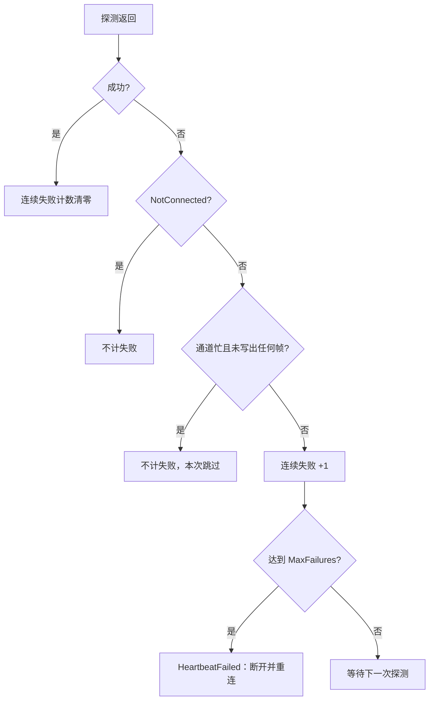

# 通道重连、心跳与超时（行为契约）

<cite>
**本文引用的文件**
- [Junevy.Communication.Channels/Lifecycle/ConnectionSupervisor.cs](file://Junevy.Communication.Channels/Lifecycle/ConnectionSupervisor.cs)
- [Junevy.Communication.Channels/Lifecycle/StreamClientOptions.cs](file://Junevy.Communication.Channels/Lifecycle/StreamClientOptions.cs)
- [Junevy.Communication.Channels/Lifecycle/DatagramClientOptions.cs](file://Junevy.Communication.Channels/Lifecycle/DatagramClientOptions.cs)
- [Junevy.Communication.Channels/Lifecycle/BackoffPolicyFactory.cs](file://Junevy.Communication.Channels/Lifecycle/BackoffPolicyFactory.cs)
- [Junevy.Communication.Channels/Lifecycle/HeartbeatMonitor.cs](file://Junevy.Communication.Channels/Lifecycle/HeartbeatMonitor.cs)
- [Junevy.Communication.Channels/Lifecycle/HeartbeatProbeScope.cs](file://Junevy.Communication.Channels/Lifecycle/HeartbeatProbeScope.cs)
- [Junevy.Communication.Channels/Pipeline/PendingRequestTable.cs](file://Junevy.Communication.Channels/Pipeline/PendingRequestTable.cs)
- [Junevy.Communication.Channels/Pipeline/StreamChannel.cs](file://Junevy.Communication.Channels/Pipeline/StreamChannel.cs)
- [Junevy.Communication.Channels/Pipeline/FrameRouter.cs](file://Junevy.Communication.Channels/Pipeline/FrameRouter.cs)
- [Junevy.Communication.Channels/Pipeline/DatagramChannel.cs](file://Junevy.Communication.Channels/Pipeline/DatagramChannel.cs)
- [Junevy.Communication.Channels/Options/HeartbeatOptions.cs](file://Junevy.Communication.Channels/Options/HeartbeatOptions.cs)
- [Junevy.Communication.Channels/Options/ReconnectOptions.cs](file://Junevy.Communication.Channels/Options/ReconnectOptions.cs)
- [Junevy.Communication.Core/Resilience/ExponentialBackoff.cs](file://Junevy.Communication.Core/Resilience/ExponentialBackoff.cs)
- [Junevy.Communication.Core/Utils/TimeoutScope.cs](file://Junevy.Communication.Core/Utils/TimeoutScope.cs)
- [Junevy.Communication.Tcp/Server/TcpServer.cs](file://Junevy.Communication.Tcp/Server/TcpServer.cs)
- [Junevy.Communication.Tcp/Server/TcpServerOptions.cs](file://Junevy.Communication.Tcp/Server/TcpServerOptions.cs)
- [Junevy.Communication.Serial/SerialChannel.cs](file://Junevy.Communication.Serial/SerialChannel.cs)
- [Junevy.Communication.Udp/UdpChannelSettings.cs](file://Junevy.Communication.Udp/UdpChannelSettings.cs)
- [Tests/Junevy.Communication.Channels.Tests/HeartbeatTests.cs](file://Tests/Junevy.Communication.Channels.Tests/HeartbeatTests.cs)
- [Tests/Junevy.Communication.Channels.Tests/StreamClientChannelTests.cs](file://Tests/Junevy.Communication.Channels.Tests/StreamClientChannelTests.cs)
- [Tests/Junevy.Communication.Tcp.Tests/TcpServerReentrancyTests.cs](file://Tests/Junevy.Communication.Tcp.Tests/TcpServerReentrancyTests.cs)
- [Junevy.Communication.Modbus/Core/Transports/ModbusTransportBase.cs](file://Junevy.Communication.Modbus/Core/Transports/ModbusTransportBase.cs)
- [docs/superpowers/specs/2026-10-10-communication-core-design.md](file://docs/superpowers/specs/2026-10-10-communication-core-design.md)
- [docs/superpowers/plans/2026-10-10-p1-communication-channels.md](file://docs/superpowers/plans/2026-10-10-p1-communication-channels.md)
</cite>

## 目录
1. [超时总表](#超时总表)
2. [客户端通道行为契约](#客户端通道行为契约)
3. [服务端行为契约](#服务端行为契约)
4. [迟到应答与请求锁](#迟到应答与请求锁)
5. [握手积压](#握手积压)
6. [心跳规则](#心跳规则)
7. [对端结束（EOF）时的处理](#对端结束eof时的处理)
8. [重连](#重连)
9. [释放（Dispose）契约](#释放dispose契约)
10. [与 Modbus 懒重连的差异](#与-modbus-懒重连的差异)

## 超时总表

| 超时 | 默认值 | 适用 | 作用范围 | 到期行为 | 结果与原因 |
|---|---|---|---|---|---|
| `ConnectTimeout` | 2000 | TCP 客户端（必须为正数） | 单次 TCP 连接；每次重连尝试各计一次 | 本次连接失败；按重连策略继续 | `Timeout` |
| `OpenTimeout` | 2000 | 串口（必须为正数） | 整个打开过程，含每 20 ms 一次的拒绝访问重试 | 本次打开失败；超时后端口在驱动返回时释放 | `Timeout` |
| `HandshakeTimeout` | 5000 | TCP 客户端、串口、UDP（基类 `ClientChannelSettings` 同值） | TLS 认证（仅 TCP）与 `IConnectionInitializer` 共用一个窗口，从传输打开之后开始计时 | 关闭连接，视为连接失败 | `Timeout` |
| `SessionHandshakeTimeout` | 10000 | TCP 服务端会话 | 会话的 TLS 认证与初始化 | 关闭会话，不触发 `SessionConnected` | `Timeout`（无会话事件） |
| `SendTimeout` | 2000 | 全部 | 单帧整体写出 | 本次失败，连接同时断开（`SendFailed`） | `Timeout` |
| `RequestTimeout` | 2000 | 全部；`RequestOptions.Timeout` 可按次覆盖 | 从帧写出完成到收到匹配应答；排队等请求锁的时间不计入 | 见下节"客户端通道行为契约"的"请求超时"行 | `Timeout` |
| `LateReplyWindow` | -1（等于 `RequestTimeout`） | 串口、UDP；TCP 在 `ResetOnRequestTimeout = false` 时；`Keyed` 模式 | 超时后丢弃迟到应答的时间窗 | — | — |
| `PartialFrameTimeout` | 0（禁用） | TCP、串口 | 缓冲中有未成帧数据、且没有新数据的时长 | TCP 断开（`PartialFrameTimeout`）；串口丢弃残余 | — |
| `GapTimeout`（`IdleGap`） | 20 | 串口默认分帧 | 判定帧结束的静默时间 | 把已收数据作为一帧交出 | — |
| `Heartbeat.Interval` / `Timeout` / `MaxFailures` | 5000 / 2000 / 3 | 全部 | 探测周期；单次探测时限；连续失败次数 | 连续失败达到 `MaxFailures`：断开并重连 | `HeartbeatFailed` |
| `IdleTimeout` | 0（禁用） | TCP 客户端、串口、UDP | 连续没有入站帧的时长 | 断开并重连 | `IdleTimeout` |
| `SessionIdleTimeout` | 0（禁用） | TCP 服务端会话 | 同上 | 关闭该会话 | `IdleTimeout` |
| `DisconnectTimeout` | 1000 | TCP 客户端、串口、UDP（基类同值） | `DisconnectAsync` 的优雅关闭：排空已收到但未派发的帧 | 强制关闭 | — |
| `StopTimeout` | 3000 | TCP 服务端 | `StopAsync` 等待会话关闭 | 强制中止剩余会话 | — |
| `Reconnect.Interval` / `MaxInterval` / `MaxAttempts` | 1000 / 30000 / 0（无限） | 启用重连的客户端 | 指数退避的基础间隔与上限；`MaxAttempts` 次后放弃 | 次数耗尽：进入 `Disconnected` | `ReconnectExhausted` |
| `RequestRetryCount` | 0 | UDP | 请求超时后原样重发的次数，每次单独计时 | 全部尝试超时：`Timeout`，并登记迟到窗口 | `Timeout` |
| TCP KeepAlive（`TcpKeepAliveOptions`） | Time 30000 ms / Interval 5000 ms / RetryCount 3（net472 不设置 RetryCount） | TCP（操作系统层） | 半开连接探测 | 由系统断开 | — |

约定：

- 除 `ConnectTimeout`、`OpenTimeout` 外，数值为 0 的超时表示**不限时**（`TimeoutScope` 对不大于 0 的值不设定时器）。
- 负值被拒绝：基类与 TCP、串口、UDP 的配置对负值抛 `ArgumentOutOfRangeException`（D5）。`LateReplyWindow` 允许 -1，表示"等于请求超时"。
- `ConnectTimeout` 与串口的 `OpenTimeout` 必须为正数，构造时校验。
- `Sequential` 模式下排队等请求锁的时间不计入 `RequestTimeout`，由调用方的取消令牌约束。

## 客户端通道行为契约

适用于 TCP 客户端、串口与 UDP（`UdpChannel` 的行为同样由监督器与数据报管线实现）。

| 场景 | 处理 |
|---|---|
| `ConnectAsync` 成功 | `Connecting` → `Connected`；启动字节管线、派发与心跳；返回 `Success` |
| `ConnectAsync` 失败 | 返回失败结果；若 `Reconnect.Enabled` 且 `OnInitialFailure = true`，进入 `Reconnecting` 并启动后台循环，否则进入 `Disconnected`。失败原因为 `AuthenticationFailed`（`DisconnectReason.AuthenticationFailed`）或 `Error` |
| 对端关闭、读取异常、端口拔出 | 在途请求以 `ConnectionClosed` 结束；启用重连则进入 `Reconnecting`，否则进入 `Disconnected`。原因为 `RemoteClosed` 或 `Error`。EOF 的处理见下文 |
| 发送超时、发送异常、写出中被取消 | 本次返回失败（超时为 `Timeout`，取消为 `Cancelled`）；连接断开（`SendFailed`），之后按上一行处理。取消写出同样断开，因为可能已写出半帧（D10）。取消发生在等待发送锁期间则只返回 `Cancelled`，不断开 |
| 请求超时 | 返回 `Timeout`。TCP 的 `Sequential` 且 `ResetOnRequestTimeout = true` 时断开并重建（`RequestTimeout`）；串口、UDP 与 `Keyed` 进入迟到应答丢弃窗口；`Matcher` 无法识别迟到应答，不设窗口。`Sequential` 模式下用户取消等待应答与超时同样处理（D10） |
| 帧超长或分帧异常 | `ProtocolViolation`：TCP 断开并重连；串口丢弃残余数据后继续。握手积压溢出按同一规则处理（见下文"握手积压"）。数据报通道丢弃该数据报并计 `ProtocolErrors`，不断开 |
| 心跳连续失败 N 次 | `HeartbeatFailed`：断开并重连。探测返回 `NotConnected`、或探测因通道忙而未写出任何帧时，不计为失败 |
| 断开期间 `SendAsync`、`RequestAsync`、`ReceiveAsync` | 立即返回 `NotConnected`。不排队，不隐式连接 |
| 用户 `DisconnectAsync` | 停止重连；在途请求以 `ConnectionClosed` 结束；在 `DisconnectTimeout` 内排空已收到但未派发的帧；之后**不会被任何发送悄悄连回**。处于 `Reconnecting` 时直接进入 `Disconnected`（`UserRequested`） |
| 重连次数耗尽 | `Disconnected`，原因 `ReconnectExhausted` |
| `Dispose` | 见下文"释放契约" |
| 事件处理器抛出异常 | 每个订阅者的异常单独捕获并记日志，不影响其他订阅者与接收循环 |

## 服务端行为契约

适用于 `TcpServer`。

| 场景 | 处理 |
|---|---|
| `StartAsync` 端口已被占用 | 返回 `ResourceExhausted`；`State` 保持 `Stopped` |
| `StartAsync` 其他套接字绑定错误 | 返回 `ConnectionClosed`；`State` 保持 `Stopped`。`ListenAddress` 不是合法 IP 字面量时在构造 `TcpServer` 时即抛出 `ArgumentException` |
| 监听器运行中故障 | `State` 变为 `Faulted`；`RestartOnFault.Enabled` 时按退避策略重新监听 |
| 超过 `MaxSessions`、不在 `AllowedRemoteAddresses`、被 `IConnectionFilter` 拒绝 | 立即关闭连接，记 Warning，不触发 `SessionConnected` |
| 会话握手失败或超时 | 关闭该会话，不触发任何会话事件 |
| 会话对端关闭、读取异常、空闲超时、心跳失败、协议违规 | 拆除会话，触发 `SessionClosed`，并携带 `DisconnectReason` 与异常 |
| `BroadcastAsync` | 只向已连接且通过过滤的会话发送；返回成功发送的会话数。失败的会话按自身的发送失败规则关闭 |
| `StopAsync` | 停止接收新连接 → 并行关闭全部会话（`UserRequested`）→ 等待至多 `StopTimeout` → `Stopped` |
| `SessionConnected` 处理器阻塞 | 推迟该会话积压帧的派发与心跳启动，并推迟其他服务端事件的派发（计划 20.1 第 33 项） |

## 迟到应答与请求锁

超时后到达的应答称为迟到应答。按关联模式处理如下：

| 模式 | 请求超时后 | 迟到应答如何识别 | 请求锁 |
|---|---|---|---|
| `Sequential` | 超时不重建连接时，在迟到窗口内继续持有请求锁，下一个请求不会在窗口期内发出；窗口截止之前到达的未认领帧丢弃 | 时间窗（`sequentialLateUntil`） | 窗口期内持有 |
| `Keyed` | 超时的关联键记入"近期超时键"表（最多 256 个，超出时淘汰最早过期的键）；窗口内同键的应答记 Warning 后丢弃，**不当作主动上报派发** | 关联键（`IFrameKeyExtractor`） | 不使用（允许并发在途） |
| `Matcher` | 无法识别迟到应答；按未认领帧派发给宿主 | 不识别 | 不使用 |

规则：

- 迟到窗口长度 = `LateReplyWindow`（不小于 0 时）；否则取本次请求超时。超时为 0 时窗口为 0。
- `Keyed` 模式下 `RequestAsync` 忽略 `RequestOptions.Matcher`，按关联键匹配；`ReceiveAsync` 在所有模式下都使用 `Matcher`（接收等待者没有关联键）。
- UDP 的请求在全部重试都超时后登记迟到窗口；发送失败立即返回，不进入窗口。

## 握手积压

握手期间（`IConnectionInitializer` 执行中，以及服务端会话的握手期间）未被认领的入站帧进入积压缓冲：

- 握手期间不派发 `FrameReceived`。
- 之后注册的 `ReceiveAsync` 先扫描积压，可以立即认领积压中的帧。
- 握手结束后，积压按到达顺序进入派发队列。
- **上限 64 帧**（`PendingRequestTable.MaxHandshakeBacklog`）。溢出时：字节流按 `ProtocolViolation` 处理（TCP 断开；串口丢弃残余）；数据报丢弃该数据报并计 `ProtocolErrors`。

积压的目的是解决"对端一连上就发帧、宿主还没来得及注册等待者"的竞态（典型例子：HSMS 被动端等待 `Select.req`，设计文档第 5.6 节）。

## 心跳规则

**探测结果的判定**：

- 探测成功：连续失败计数清零。
- 探测返回 `NotConnected`：不计失败（连接正在关闭或重建，由生命周期处理）。
- 探测因通道忙而未写出任何帧（排在请求锁或发送锁上直到超时）：不计失败，本次跳过，不影响连续失败计数。
- 探测超时或返回其他失败（包括 `ProtocolViolation`，即内置探测的回显不匹配）：连续失败计数加 1。达到 `MaxFailures` 时报告 `HeartbeatFailed`。

**空闲探测**：`OnlyWhenIdle = true`（默认）时，上一次判定之后若有收发流量，本次探测跳过，不计失败。

**探测期间的请求超时**：不触发 `ResetOnRequestTimeout` 的重建，由 `MaxFailures` 计数（计划 20.1 Task 8）。

**检测耗时**：自第一次探测开始算起，第 `MaxFailures` 次失败约在 `(MaxFailures − 1) × Interval + Timeout` 之后判定。这个公式以"探测间隔大于单次超时"为前提（否则相邻两次探测几乎首尾相接）。从监视器启动算起还要加一个 `Interval`，因为首次探测在启动后一个 `Interval` 才发出。

**配置约束**（构造时校验，`ArgumentException` 或 `ArgumentOutOfRangeException`）：

- 以下约束只在 `Heartbeat.Enabled = true` 时检查：`Interval`、`Timeout` 必须为正数，`MaxFailures` 不小于 1。
- 启用心跳且既没有 `ChannelComponents.HealthProbe` 也没有 `ChannelComponents.HealthProbeFactory` 时，`Heartbeat.Payload` 必填。
- **UDP 与串口**：没有 `HealthProbe` 与 `HealthProbeFactory` 时必须设置 `Heartbeat.ExpectedReply`，因为 UDP 与串口的写入几乎总是成功，"发送成功即健康"检测不到对端沉默。
- **UDP 非定向模式**：启用内置心跳必须提供 `HealthProbe` 或 `HealthProbeFactory`，因为内置探测发往远端，而非定向通道没有远端。
- **探测工厂**（20.1 第 39 项）：只在启用心跳时调用。客户端在第一次成功打开、启动心跳之前以通道自身为参数调用一次，结果跨重连复用（之后的重连不再调用）。工厂抛出或返回 null 使本次打开失败（`Unspecified`），连接随即关闭；由重连策略决定是否再试，下一次打开会再次调用工厂。服务端在每个会话启动心跳时调用一次，参数为该会话。
- **TCP**：`ExpectedReply` 可以为空，此时发送成功即健康。

**内置探测的比较**：`ExpectedReply` 按整帧逐字节精确匹配（D14）。`Payload` 与 `ExpectedReply` 都支持 `hex:` 前缀（见 [[API参考/通道与传输（TCP UDP 串口 TLS）]] 的"分帧工具"一节）。

## 对端结束（EOF）时的处理

对端关闭或读取出错时，**先处理完已收到的数据，再报告故障**：

1. 填充循环记录结束原因（0 字节为 `RemoteClosed`，`IOException` 为 `RemoteClosed`，其他异常为 `Error`），并完成管道写端。
2. 解析循环处理缓冲中的全部数据，已完整的帧照常派发。
3. 缓冲中剩余的数据：可刷新分帧器（`IdleGap`）整段交出；其余分帧器的残留半帧丢弃，并计入 `ProtocolErrors` 且记 Warning。
4. 最后才报告记录的原因，连接进入 `Reconnecting` 或 `Disconnected`。

这样，对端在关闭前发出的最后几帧不会因为故障报告而丢失。

## 重连

重连只在 `Reconnect.Enabled = true` 时发生。`ChannelComponents.ReconnectPolicy` 可以覆盖由 `ReconnectOptions` 推导的退避策略，但重连仍受 `Reconnect.Enabled` 控制。

退避策略（`BackoffPolicyFactory`）：

- `ExponentialBackoff`（默认）：第 n 次重试前的基础等待为 `min(MaxInterval, Interval × 2^(n−1))`，实际等待为基础等待乘以 `1 ± 20%` 的随机抖动，结果夹在 `[0, MaxInterval]` 之内。
- `FixedInterval`：每次等待 `Interval`。
- `MaxAttempts = 0` 表示无限重试；超过后循环结束，进入 `Disconnected`（`ReconnectExhausted`）。

循环的节奏：先等待退避时间，再取生命周期锁，执行一次打开。成功即结束循环；失败则进入下一轮。用户的 `DisconnectAsync` 或 `Dispose` 会取消并等待循环退出。

状态转换图见 [[架构设计/字节通道族内部结构]]。

## 释放（Dispose）契约

| 调用 | 行为 |
|---|---|
| `DisconnectAsync(ct)` | 优雅断开。停止重连；TCP 先对套接字执行 `Shutdown(Send)`；在 `DisconnectTimeout` 内排空已收到但未派发的帧；然后关闭。之后不会被发送悄悄连回。等待生命周期锁期间被取消时，若处于 `Reconnecting` 则转为 `Disconnected` |
| `DisposeAsync()` | 立即释放。取消重连与进行中的打开；关闭连接，**不排空**已收到的帧；在途与排队的请求以 `ConnectionClosed` 返回；进入 `Disposed`。之后再调用 `ConnectAsync` 等抛出 `ObjectDisposedException`；`DisconnectAsync` 直接返回 |
| `Dispose()` | 同步等待 `DisposeAsync` 完成，最长 `DisconnectTimeout + 1000` ms（TCP 服务端为 `StopTimeout + 1000` ms）。超时后记 Warning，释放在后台继续。库内部的 `await` 全部使用 `ConfigureAwait(false)`，因此不会因同步上下文死锁 |
| 在 `StateChanged` 处理器内调用 `DisposeAsync` / `DisconnectAsync` | 不死锁。派发上下文内只发出停止信号，不等待派发任务。测试：`StreamClientChannelTests.DisposeFromStateChangedHandler_NoDeadlock`、`SupervisorTests.StateChangedHandler_CallsDisconnect_NoDeadlock` |
| 在 `FrameReceived` 处理器内调用 `DisposeAsync` / `DisconnectAsync` | 不死锁。派发上下文内，路由只完成写端、取消派发循环，并把队列中**尚未派发的帧计为丢弃**（不排空）。测试：`DisposeFromFrameReceivedHandler_NoDeadlock`、`DisconnectFromFrameReceivedHandler_NoDeadlock` |
| 在服务端事件处理器内调用 `StopAsync`、会话 `CloseAsync`、`Dispose` | 不死锁。测试：`TcpServerReentrancyTests` 中的 `StopFromSessionFrameHandler_NoDeadlock`、`CloseSessionFromSessionConnectedHandler_NoDeadlock`、`DisposeFromSessionClosedHandler_NoDeadlock` |
| 排空时限到期 | 返回时只保证不再派发**新**的帧；不等待仍在执行的事件处理器；未派发的帧计入 `FramesDropped` |
| 事件处理器抛出异常 | 捕获并记日志，不影响接收循环 |

## 与 Modbus 懒重连的差异

Modbus 采用**懒重连**：重连只发生在请求路径上，没有后台循环（[[行为契约/重连重试与并发模型]]）。通道族有意采用**后台主动重连**，两者在本库中并存：

| 项 | Modbus（`ModbusTransportBase`） | 通道族（`ConnectionSupervisor`） |
|---|---|---|
| 重连的触发 | 请求开始前（`EnsureConnected`），或失败后（`RequiresNewConnection`） | 接收循环或心跳检测到丢失即调度，不依赖请求 |
| 断开后的请求 | `Reconnect = true` 时静默重建连接 | 立即返回 `NotConnected`，不隐式连接 |
| 显式断开之后 | `Reconnect = true` 时，下一次请求会重建连接（已知坑） | 不会被发送连回，只能再次 `ConnectAsync` |
| 默认 | `Reconnect = false` | `Reconnect.Enabled = false` |
| 后台线程 | 无 | 无常驻看门狗；重连循环只在连接丢失后存在 |
| 设计理由 | 工业轮询的请求天然周期性，懒重连足够，看门狗的收益不抵复杂度 | 设备主动上报时可能长时间没有请求，懒重连无从触发；接收循环常驻，能第一时间发现断线；同时消除"`Disconnect()` 之后下一次请求悄悄重连"的问题（设计第 11.2 节） |

Modbus 本身不受影响（设计 Q4）。使用者需要知道：同一个进程里，Modbus 客户端与通道族客户端的重连时机不同，不能用同一套预期去推断两者的行为。
