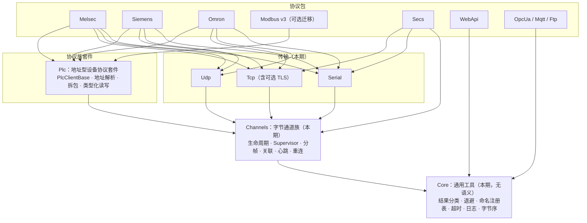
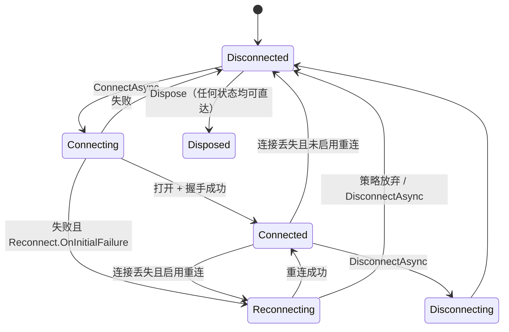
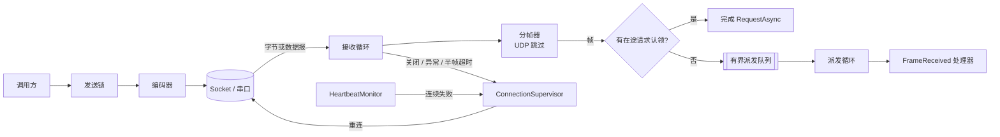

# 通讯库扩展架构设计

> 状态：第二轮审阅后重写（2026-10-10），**全部决策已确认**（第 21 节）；第 20 节记录审阅发现与改动。下一步按阶段编写实施计划 `docs/superpowers/plans/`。
> 日期：2026-10-10
> 本期范围（P1）：通用工具（Core）+ 字节通道族（Channels：TCP 客户端/服务端含可选 TLS、UDP、串口）+ 测试套件。
> 已规划：地址型设备协议套件 + MELSEC、WebAPI（MES）、S7、SECS/GEM、OPC UA / MQTT / FTP、Modbus 迁移（第 19 节）。

---

## 1. 核心判断：共享实现，不共享语义

设计目标是**扩展性**：以后新增一个协议（例如 MELSEC）时，能在现有基础上很快搭好主体。抽象程度本身不是目标。

第一轮设计试图让所有协议实现同一个顶层接口，第二轮审阅认为这是错的（详见第 20 节）：SECS 的"已连接"要区分 Not Selected 和 Selected，GEM 还有通讯状态与控制状态；OPC UA 有会话、订阅和逐项状态码；WebAPI 根本没有连接。强行统一只会把这些语义压扁。

因此改为**按协议族组织**：

- **族内**统一接口与骨架，新协议继承骨架、只写协议差异；
- **族间**只共享"没有语义的工具"（结果分类、退避算法、命名注册表、超时工具、日志、字节序）。

| 协议族 | 成员 | 族内共享什么 | 对外 API |
|---|---|---|---|
| **字节通道族** | TCP、TLS、UDP、串口 | 连接生命周期、分帧、请求-应答关联、心跳、重连、超时 | `IClientChannel` / `IByteChannel` |
| **地址型设备协议族** | MELSEC MC、S7、欧姆龙 FINS、Modbus（v3 迁移后） | 建立在字节通道族之上：请求管线、类型化读写、地址解析、拆包、字节序 | `IPlcClient` + 类型化扩展方法 |
| **SECS** | HSMS、SECS-I、GEM | **内部**复用字节通道族的实现 | 原生：SECS-II 消息、HSMS 状态、GEM 状态 |
| **SDK 协议** | OPC UA、MQTT、FTP、厂商 DLL | 只用 Core 工具 | 原生：保留各 SDK 的模型 |
| **无状态请求** | WebAPI（REST、SOAP）、HTTP 服务端 | 只用 Core 工具 | 原生：HTTP 语义 |

关于 PROFINET：PROFINET IO 本身是二层实时以太网，PC 端需要专用协议栈或通讯卡，归入"SDK 协议"；通过 PROFINET 网口读写西门子 PLC 数据，实际走的是 S7 协议（TCP 102 端口），归入"地址型设备协议族"。

### 1.1 新协议归类指引

```mermaid
flowchart TD
    N[新协议] --> Q1{socket 或串口由谁管?}
    Q1 -->|第三方 SDK / 厂商 DLL| C["SDK 协议<br/>独立包，原生 API<br/>只依赖 Core"]
    Q1 -->|HTTP 栈| D["无状态请求<br/>并入 WebApi 或独立包<br/>只依赖 Core"]
    Q1 -->|我们自己| Q2{是否"按地址读写存储区"?}
    Q2 -->|是| P["地址型设备协议族<br/>继承 PlcClientBase<br/>只写地址表、帧、错误码"]
    Q2 -->|否，有自己的消息模型| S["自有模型协议（如 SECS）<br/>原生 API<br/>内部使用 Channels 部件"]
```

---

## 2. 设计原则

1. **扩展性优先于抽象度**：衡量标准是"新增一个协议要写多少代码、要不要改公共代码"，不是"有多少协议实现了同一个接口"。
2. **族内统一，族间只共享工具**：只有语义真正一致的协议才共用接口；特殊协议保留原生模型。
3. **协议与传输分离**：协议客户端**持有**一条字节通道，而不是继承 socket。MELSEC 的 TCP、UDP、串口三种接法共用一套 MC 协议代码；SECS 的 HSMS（TCP）和 SECS-I（串口）共用 SECS-II 编解码。
4. **组合优于继承，骨架用模板方法**：通道层用可组合部件（Supervisor、StreamChannel、分帧器、探测器、策略）；协议族内部用模板方法基类（`PlcClientBase`），这与 Modbus 的 `ModbusTransportBase` 已验证的做法一致。
5. **依赖隔离**：每种传输、每个协议一个包；第三方 SDK 只出现在各自的适配包里；特殊协议族不依赖通道机制。
6. **沿用 Modbus 已验证的契约**：失败一律走结果对象，编程错误抛标准异常；Dispose 契约、超时与取消的区分、net472 的"取消时销毁 socket"降级手法、重试规则 A–F 的语义都直接继承。
7. **配置可序列化**：`XxxConfig` / `XxxOptions` 只含 POCO 字段，可以直接从 JSON 加载；自定义策略对象、证书对象通过代码注入。
8. **双目标 net472 + net8.0**；新模块只提供异步 API（Q2）。

---

## 3. 分层与程序集



### 3.1 程序集（NuGet 包）

| 程序集 | 内容 | 依赖 | 阶段 |
|---|---|---|---|
| `Junevy.Communication.Core` | 通用工具：`CommResult` / `CommErrorKind`、退避与重试循环、`NamedRegistry<T>`、超时工具、日志工具、字节序转换 | `Microsoft.Extensions.*.Abstractions`、BCL 兼容包 | P1 |
| `Junevy.Communication.Channels` | 字节通道族：接口、状态机、Supervisor、StreamChannel、DatagramChannel、分帧器、关联、心跳、重连、`ChannelFactory` | Core + `System.IO.Pipelines` + `System.Threading.Channels` | P1 |
| `Junevy.Communication.Tcp` | `TcpClientChannel`、`TcpServer`、`TcpSession`、可选 TLS | Channels | P1 |
| `Junevy.Communication.Udp` | `UdpChannel`（定向 / 非定向、广播、组播） | Channels | P1 |
| `Junevy.Communication.Serial` | `SerialChannel` | Channels + System.IO.Ports | P1 |
| `Junevy.Communication.Plc` | 地址型设备协议套件 | Channels | P2 |
| `Junevy.Communication.Melsec` | 三菱 MC 协议 | Plc + Tcp + Udp + Serial | P2 |
| `Junevy.Communication.WebApi` | REST 客户端、SOAP 客户端、HTTP 服务端 | Core + System.Text.Json | P3 |
| `Junevy.Communication.Siemens` / `.Omron` | S7、FINS | Plc + 所需传输包 | P4 |
| `Junevy.Communication.Secs` | SECS-II、HSMS、SECS-I，之后是 GEM | Channels + Tcp + Serial | P5 |
| `Junevy.Communication.OpcUa` / `.Mqtt` / `.Ftp` | SDK 适配 | Core + 对应第三方 SDK | P6 |
| `Junevy.Communication.Modbus` | 现有，本期不动 | 现状 | P7 可选迁移 |
| `Junevy.Communication.Testing` | 测试套件（内部共享测试工程，暂不发布） | Channels | P1 起持续扩充 |

**依赖规则**：
- 只允许向下依赖；同层协议包之间互不引用。
- 只有字节通道族及其上层（Plc、Secs、PLC 协议）依赖 Channels；WebApi、OpcUa、Mqtt、Ftp 只依赖 Core，不会被带上 Pipelines 和通道机制。
- 协议包直接引用自己支持的传输包（例如 Melsec 引用 Tcp、Udp、Serial），用户不需要自己组装。
- 第三方包只允许出现在 SDK 适配包中（Q3）。

### 3.2 仓库目录

```
Junevy.Communication.Core/
  Results/        CommResult, CommResult<T>, CommErrorKind
  Resilience/     IBackoffPolicy, FixedIntervalBackoff, ExponentialBackoff, RetryLoop
  Registry/       NamedRegistry<T>（命名 + 别名 + 安全释放）
  Buffers/        ByteTransform, WordOrder（ABCD/BADC/CDAB/DCBA）, 字符串编解码
  Diagnostics/    十六进制格式化、敏感信息脱敏
  Utils/          TimeoutScope（链接 CTS + 超时/取消判别 + net472 销毁中止）
Junevy.Communication.Channels/
  Abstractions/   IConnectable, IClientChannel, IByteChannel, IFrameDecoder, IFlushableFrameDecoder, IFrameEncoder,
                  IFrameCodecFactory, IResponseMatcher, IFrameKeyExtractor, IHealthProbe, IConnectionInitializer,
                  IChannelConfig, IChannelCreator
  Models/         ConnectionState, DisconnectReason, ConnectionStateChangedEventArgs, FrameReceivedEventArgs,
                  ConnectionStatistics, RequestOptions
  Options/        FramingOptions, HeartbeatOptions, ReconnectOptions, ChannelComponents
  Lifecycle/      ConnectionSupervisor (internal), HeartbeatMonitor (internal)
  Framing/        Raw / Delimiter / FixedLength / LengthField / StartEnd / IdleGap
  Pipeline/       FrameRouter, StreamChannel, DatagramChannel, PendingRequestTable (internal)
  Factory/        ChannelFactory
  DependencyInjection/
Junevy.Communication.Tcp/       Client/  Server/  Tls/  Options/  DependencyInjection/
Junevy.Communication.Udp/
Junevy.Communication.Serial/
Junevy.Communication.Testing/   （测试套件，见第 13 节）
Junevy.Communication.Core.Tests/  .Channels.Tests/  .Tcp.Tests/  .Udp.Tests/  .Serial.Tests/
```

---

## 4. Core：通用工具（无语义）

Core 只放"任何协议拿去用都不会被扭曲语义"的东西。

| 工具 | 作用 | 谁会用 |
|---|---|---|
| `CommResult` / `CommResult<T>` / `CommErrorKind` | 粗粒度的结果分类，供宿主统一告警和重试决策 | 字节通道族、地址型协议族直接使用；特殊协议在自己的结果类型里附带一个 `ErrorKind` 字段 |
| `IBackoffPolicy` + `RetryLoop` | 固定间隔 / 指数退避（带抖动）的纯计算，以及"按策略重试直到成功或放弃"的循环 | 通道重连、MQTT 重连、WebApi 重试 |
| `NamedRegistry<T>` | 命名实例 + 别名 + 并发安全 + 移除时释放；沿用 `ModbusConnectionManager` 已修复的规则 | 各族自己的工厂 |
| `TimeoutScope` | 链接 CTS + `CancelAfter`；区分"超时"和"用户取消"；net472 上超时时销毁底层对象 | 全部 |
| `ByteTransform` / `WordOrder` | 整数、浮点、字符串与字节的互转，支持 ABCD/BADC/CDAB/DCBA | 地址型协议族、SECS-II、自定义协议 |
| 十六进制格式化、脱敏 | TX/RX 日志、敏感头脱敏 | 全部 |

```csharp
public enum CommErrorKind
{
    // 0–7 与 ModbusErrorKind 数值一一对应，未来 Modbus 迁移时可直接映射
    None = 0,
    Unspecified = 1,
    InvalidRequest = 2,
    ConnectionClosed = 3,      // 操作过程中连接断开 / 发送失败
    Timeout = 4,
    ProtocolViolation = 5,     // 帧格式、长度、校验、关联键不符、反序列化失败
    RemoteError = 6,           // 对端返回的协议级错误（Modbus 异常码、MC 结束码、S7 错误码、HTTP 4xx/5xx …）
    Cancelled = 7,
    NotConnected = 8,          // 操作开始时就未连接
    AuthenticationFailed = 9,  // TLS 证书校验失败、登录失败
    ResourceExhausted = 10,    // 会话数已满、队列已满
    NotSupported = 11,
}

public sealed class CommResult
{
    public bool IsSuccess { get; }
    public CommErrorKind ErrorKind { get; }
    public string? ErrorMessage { get; }
    public long? ProtocolErrorCode { get; }   // 协议原始错误码，如 MC 结束码 0xC051
    public Exception? Exception { get; }      // 仅供诊断，不参与决策
}
public sealed class CommResult<T> { /* 同上 + T? Data */ }
```

`CommErrorKind` 是**粗分类**，不承载协议的完整错误语义。规则沿用 Modbus：`Fail(..., None)` 抛 `ArgumentException`；决策只看 `ErrorKind`，不匹配消息字符串；`ErrorKind` 逐层透传。

---

## 5. Channels：字节通道族

### 5.1 接口

```csharp
/// 拥有一条字节链路的对象的链路状态。通道和地址型协议客户端都实现它，语义都是"底层链路是否可用"。
public interface IConnectable
{
    string Name { get; }
    ConnectionState State { get; }
    bool IsConnected { get; }
    ConnectionStatistics Statistics { get; }
    event EventHandler<ConnectionStateChangedEventArgs>? StateChanged;

    /// 失败返回 Fail；用户取消抛 OperationCanceledException（与 IModbus.ConnectAsync 一致）。
    Task<CommResult> ConnectAsync(CancellationToken cancellationToken = default);
    /// 用户主动断开：停止后台重连，此后不会自动连回。
    Task DisconnectAsync(CancellationToken cancellationToken = default);
    /// 等待进入 Connected；超时返回 false。
    Task<bool> WaitForConnectedAsync(int timeout, CancellationToken cancellationToken = default);
}

/// 字节收发能力。TCP 客户端、TCP 服务端会话、UDP、串口都实现它。
/// 不声明 IsConnected：链路状态属于 IConnectable；两处同时声明会让 IClientChannel 上的访问产生歧义（CS0229）。
public interface IByteChannel
{
    Task<CommResult> SendAsync(ReadOnlyMemory<byte> payload, CancellationToken cancellationToken = default);
    Task<CommResult<byte[]>> RequestAsync(ReadOnlyMemory<byte> payload, RequestOptions? options = null, CancellationToken cancellationToken = default);
    /// 不发送，只等待下一个匹配帧（例如等设备主动上报 "READY"）。
    Task<CommResult<byte[]>> ReceiveAsync(RequestOptions? options = null, CancellationToken cancellationToken = default);
    /// 未被 RequestAsync / ReceiveAsync 认领的入站帧。
    event EventHandler<FrameReceivedEventArgs>? FrameReceived;
}

/// 主动发起连接的通道：TcpClientChannel、UdpChannel、SerialChannel。
public interface IClientChannel : IConnectable, IByteChannel, IDisposable, IAsyncDisposable
{
}

public enum ConnectionState { Disconnected, Connecting, Connected, Reconnecting, Disconnecting, Disposed }

public enum DisconnectReason
{
    None, UserRequested, RemoteClosed, SendFailed, RequestTimeout, HeartbeatFailed, IdleTimeout,
    PartialFrameTimeout, ProtocolViolation, AuthenticationFailed, ReconnectExhausted, Error, Disposed,
}

public sealed class RequestOptions
{
    public int? Timeout { get; set; }               // null → Config.RequestTimeout
    public IResponseMatcher? Matcher { get; set; }  // null → 按 CorrelationMode 的默认规则
}

public sealed class FrameReceivedEventArgs : EventArgs
{
    public byte[] Data { get; }                     // 独立副本，调用方可以随意持有
    public DateTimeOffset ReceivedAt { get; }
    public EndPoint? RemoteEndPoint { get; }        // UDP 非定向模式下为来源地址；其余为 null
}
```

"已连接"在三种传输上的含义：TCP = 握手（及 TLS、初始化）完成；串口 = 端口已打开；UDP = socket 已绑定。串口和 UDP 本身无法感知对端是否在线，**必须配合心跳或空闲超时才能发现对端掉线**。

文本协议（扫码枪、视觉、机器人）用扩展方法：`SendTextAsync(string, Encoding?)`、`RequestTextAsync(...)`。

状态机：



### 5.2 分帧

TCP 和串口是字节流，没有消息边界，必须分帧（处理粘包和半包）。UDP 的数据报天然有边界，不经过分帧器。

```csharp
/// 每条连接一个实例（分帧器可以有内部状态）。
public interface IFrameDecoder
{
    /// 从缓冲区切出一帧：成功时 buffer 前移并返回 true；数据不足返回 false。
    /// 数据非法时抛 FrameDecodeException → 归类 ProtocolViolation。
    bool TryDecode(ref ReadOnlySequence<byte> buffer, out ReadOnlySequence<byte> frame);
}

/// 按"静默时间"判定帧结束：输入停顿 FlushTimeout 毫秒后，接收循环调用 TryFlush 交出残余数据。
public interface IFlushableFrameDecoder : IFrameDecoder
{
    int FlushTimeout { get; }
    bool TryFlush(ref ReadOnlySequence<byte> buffer, out ReadOnlySequence<byte> frame);
}

public interface IFrameEncoder { void Encode(ReadOnlySpan<byte> payload, IBufferWriter<byte> output); }
public interface IFrameCodecFactory { IFrameDecoder CreateDecoder(); IFrameEncoder CreateEncoder(); }
```

分帧器直接在 Pipelines 的缓冲上切帧，不额外复制；静默超时通过内部 `Pipe` 读端的 `CancelPendingRead()` 实现（为什么不直接对流使用 `PipeReader`，见 6.2）。

| Mode | 参数 | 典型场景 |
|---|---|---|
| `Raw` | — | 每次读到的数据块就是一帧（调试抓包）。串口一次读取常常只返回半帧，**串口不要用 Raw** |
| `Delimiter` | 分隔符（可多个，支持 `\r\n` 转义或十六进制）、是否保留分隔符 | 扫码枪、视觉、ASCII 指令 |
| `FixedLength` | 帧长 | 定长报文 |
| `LengthField` | 长度字段偏移、宽度、**编码（二进制大端 / 二进制小端 / ASCII 十六进制 / ASCII 十进制）**、长度修正值、剥离字节数 | Modbus TCP、S7、MELSEC（二进制与 ASCII）、HSMS、自定义协议 |
| `StartEnd` | 起始符、结束符 | STX…ETX；遇到垃圾字节自动重新同步 |
| `IdleGap` | 静默时间 `GapTimeout`（毫秒） | 没有分隔符也没有长度字段的串口设备；**串口默认值** |

所有分帧器受 `MaxFrameLength` 约束（默认 64 KiB）。

**用远期协议验证 `LengthField`**（帧总长 = 偏移 + 字段宽度 + 长度值 + 修正值）：

| 协议 | 长度字段 | LengthField 参数 |
|---|---|---|
| Modbus TCP | 第 4–5 字节，大端，计其后字节数 | offset=4, size=2, BinaryBE, adjust=0 |
| S7（TPKT/RFC1006） | 第 2–3 字节，大端，含 4 字节头的总长 | offset=2, size=2, BinaryBE, adjust=-4 |
| MELSEC 3E 二进制响应 | 第 7–8 字节，小端 | offset=7, size=2, BinaryLE, adjust=0 |
| MELSEC 3E ASCII 响应 | 第 14–17 字符，4 位十六进制 | offset=14, size=4, AsciiHex, adjust=0 |
| MELSEC 4E 二进制响应 | 第 11–12 字节，小端 | offset=11, size=2, BinaryLE, adjust=0 |
| SECS HSMS | 第 0–3 字节，大端 | offset=0, size=4, BinaryBE, adjust=0 |

### 5.3 请求-应答关联

| `CorrelationMode` | 规则 | 适用 |
|---|---|---|
| `Sequential`（默认） | 同一时刻至多一个在途请求；在途期间到达的下一帧即为应答 | 绝大多数一问一答设备，MC 3E |
| `Matcher` | 允许多个在途请求；每个入站帧按 FIFO 交给在途请求的 `IResponseMatcher` 判定 | 主动上报与应答混发的设备 |
| `Keyed` | `IFrameKeyExtractor` 从请求和应答中各取一个键做字典匹配 | Modbus TCP 的 TID、MC 4E 的序列号、S7 的 PDU 引用号、HSMS 的 System Bytes |

```csharp
public interface IResponseMatcher { bool IsMatch(ReadOnlySpan<byte> request, ReadOnlySpan<byte> frame); }
public interface IFrameKeyExtractor
{
    bool TryGetRequestKey(ReadOnlySpan<byte> request, out long key);
    bool TryGetResponseKey(ReadOnlySpan<byte> frame, out long key);
}
```

- 入站帧的处理顺序：在途的 `RequestAsync` 认领 → 迟到应答判定（是则丢弃）→ `ReceiveAsync` 等待者认领 → `FrameReceived` 事件队列。应答**不经过**事件队列，慢的事件处理器不会拖慢请求（队列满且为 `Wait` 模式时，背压会让解析暂停，此时应答也会等待）。连接停止时，已进入事件队列的帧在 `DisconnectTimeout` 内继续派发完。
- 请求超时后的迟到应答：TCP `Sequential` 默认 `ResetOnRequestTimeout = true`（超时即断开重建，与 Modbus TCP 规则 C 同理），关闭重建时与串口、UDP 一样丢弃超时后 `LateReplyWindow` 内到达的帧，并在窗口期内继续持有请求锁（不让下一个请求在窗口期内发出并误认迟到应答）；`Keyed` 保留连接，超时的键在 `LateReplyWindow` 内被记录，同键的迟到应答记 Warning 后丢弃（不当作主动上报派发，避免宿主误当成新消息）；`Matcher` 无法识别迟到应答，按未认领帧派发。

### 5.4 心跳（三层保活）

| 层 | 机制 | 能发现什么 | 适用 |
|---|---|---|---|
| 操作系统 | TCP KeepAlive | 对端掉电、网线断开导致的半开连接 | TCP |
| 应用 | 心跳探测 `IHealthProbe` | 对端进程卡死；或链路无法感知对端（串口、UDP） | 全部 |
| 被动 | 空闲超时 `IdleTimeout` | 一段时间内没有任何入站数据 | 全部 |

```csharp
/// 原始通道 = 发心跳包（可选等应答）；协议可替换为自己的探测：MC = 回环测试 0619，S7 = 读 SZL，HSMS = Linktest。
public interface IHealthProbe { Task<CommResult> ProbeAsync(CancellationToken cancellationToken); }

public sealed class HeartbeatOptions
{
    public bool Enabled { get; set; }
    public int Interval { get; set; } = 5000;
    public int Timeout { get; set; } = 2000;
    public int MaxFailures { get; set; } = 3;
    public bool OnlyWhenIdle { get; set; } = true;
    public string? Payload { get; set; }             // 内置探测的心跳内容（文本，或以 hex: 开头）
    public string? ExpectedReply { get; set; }       // 为空：发送成功即健康；非空：必须收到匹配应答
}
```

### 5.5 重连

```csharp
public sealed class ReconnectOptions
{
    public bool Enabled { get; set; }                 // 默认 false，与 Modbus 的 Reconnect=false 一致
    public ReconnectMode Mode { get; set; } = ReconnectMode.ExponentialBackoff;
    public int Interval { get; set; } = 1000;
    public int MaxInterval { get; set; } = 30000;
    public int MaxAttempts { get; set; }              // 0 = 无限
    public bool OnInitialFailure { get; set; }        // 首次连接失败也转入后台重连（设备晚于软件上电、USB 串口未插）
}
```

退避计算使用 Core 的 `IBackoffPolicy`（带 ±20% 抖动）。"重连"在三种传输上分别是：TCP 重新握手；串口重新打开端口；UDP 重新绑定 socket。

### 5.6 握手钩子与组件注入

```csharp
/// 链路连通后、状态变为 Connected 之前执行；每次重连都会重新执行。
/// 服务端对每个新会话执行同一接口（例如 HSMS 被动端等待 Select.req 并应答）。
public interface IConnectionInitializer
{
    Task<CommResult> InitializeAsync(IByteChannel channel, CancellationToken cancellationToken);
}

/// 代码级覆盖：协议包通过它把自己的分帧、关联、握手、心跳交给通道；优先级高于 Config 中的同类设置。
public class ChannelComponents
{
    public IFrameCodecFactory? FrameCodec { get; set; }
    public CorrelationMode? Correlation { get; set; }
    public IFrameKeyExtractor? KeyExtractor { get; set; }
    public IConnectionInitializer? Initializer { get; set; }
    public IHealthProbe? HealthProbe { get; set; }
    public IBackoffPolicy? ReconnectPolicy { get; set; }
}
```

`ChannelComponents` 是协议族接入通道层的唯一入口：协议声明"我这样分帧、这样匹配应答、连上后这样握手、这样探活"，通道照做。

---

## 6. Channels 内部骨架

### 6.1 ConnectionSupervisor（internal）

- 驱动接口 `IConnectionDriver { OpenAsync(ct); InitializeAsync(ct); CloseAsync(reason); }`，TCP、UDP、串口各自实现。
- 生命周期锁串行化 Connect、Disconnect、重连尝试；它与发送锁是两把锁，断线期间发送立即得到 `NotConnected`。
- `ReportConnectionLost(generation, reason, exception)` 可从任意线程调用。**连接代次**：每次连上加 1，旧代次的报告直接忽略，防止旧 socket 迟到的异常打断新连接。
- 状态事件经单消费者队列**按顺序**、在**锁外**触发，事件处理器里调用 `DisconnectAsync` 不会死锁。

### 6.2 FrameRouter / StreamChannel / DatagramChannel（internal）

- **FrameRouter**：两种通道共用的帧路由——`PendingRequestTable`（三种关联模式、超时、迟到应答）、有界派发队列（`Channel<T>`）、派发循环、`FrameReceived`、统计。
- **StreamChannel**：把 `Stream`（`NetworkStream`、`SslStream`、`SerialPort.BaseStream`）变成 `IByteChannel`。采用两个循环：**填充循环**从流读入内部 `Pipe`，**解析循环**从 `Pipe` 读出、分帧、复制、交给 FrameRouter。不直接对流使用 `PipeReader.Create(stream)`，因为 net472 的 `NetworkStream` 和 `SerialPort.BaseStream` 不响应取消令牌，`CancelPendingRead()` 打断不了挂起的流读取，静默分帧与半帧计时会失效；内部 `Pipe` 的读端则在两个目标上都可靠响应。缓冲区有未成帧数据时启动计时器（`IFlushableFrameDecoder` 到期交出残余；其他分帧器到 `PartialFrameTimeout` 时 TCP 断开、串口丢弃残余继续）；发送经发送锁和 `SendTimeout` 整帧写出，失败即报告 `SendFailed`。
- **DatagramChannel**：UDP 专用，每个数据报直接成为一帧；超过接收缓冲被截断时计为 ProtocolViolation 并丢弃。
- TLS 只是把 `NetworkStream` 换成 `SslStream`，StreamChannel 不需要改动。

### 6.3 帧内存所有权

对外交付的帧一律是**复制出来的独立 `byte[]`**，不暴露池化缓冲。工业通讯通常每秒几十到几百帧，复制开销可以忽略，换来的是用户不可能写出"缓冲已归还但还在读"的 bug。

### 6.4 线程模型与背压



- 每条连接：1 个接收循环 + 1 个派发循环（异步任务，不占专用线程）+ 可选心跳。
- 派发队列有界（默认 1024）。TCP 队列满时默认**等待**（暂停读取，由 TCP 流控让对端放慢）；串口和 UDP 没有流控，默认 `DropOldest` 并计数告警。
- 所有事件在线程池线程上触发，WPF 界面需自行切回 Dispatcher。

---

## 7. TCP（含可选 TLS）

`System.Net.Sockets.TcpClient` 已被 BCL 占用，因此客户端叫 `TcpClientChannel`，服务端叫 `TcpServer`，服务端的单个连接叫 `TcpSession`。配置类命名为"类名 + Config"。

### 7.1 TcpClientChannel

```csharp
public interface ITcpClientChannel : IClientChannel
{
    TcpClientChannelConfig Config { get; }
    IPEndPoint? RemoteEndPoint { get; }
    IPEndPoint? LocalEndPoint { get; }
    bool IsTlsActive { get; }
}

public sealed class TcpClientChannel : ITcpClientChannel
{
    public TcpClientChannel(TcpClientChannelConfig config, ILogger<TcpClientChannel>? logger = null, TcpChannelComponents? components = null);
}

public class TcpClientChannelConfig : IChannelConfig
{
    public string Host { get; set; } = "127.0.0.1";
    public int Port { get; set; }
    public string? LocalAddress { get; set; }        // 绑定本地网卡（多网卡工控机常用）
    public int LocalPort { get; set; }

    public int ConnectTimeout { get; set; } = 2000;
    public int HandshakeTimeout { get; set; } = 5000;     // TLS 握手 + IConnectionInitializer 的总时限
    public int SendTimeout { get; set; } = 2000;
    public int RequestTimeout { get; set; } = 2000;
    public int IdleTimeout { get; set; }
    public int PartialFrameTimeout { get; set; }
    public int DisconnectTimeout { get; set; } = 1000;

    public FramingOptions Framing { get; set; } = new();  // 默认 Raw；被协议包使用时由 ChannelComponents 覆盖
    public CorrelationMode Correlation { get; set; } = CorrelationMode.Sequential;
    public bool ResetOnRequestTimeout { get; set; } = true;
    public int LateReplyWindow { get; set; } = -1;               // ResetOnRequestTimeout = false 时生效；-1 = 等于 RequestTimeout
    public HeartbeatOptions Heartbeat { get; set; } = new();
    public ReconnectOptions Reconnect { get; set; } = new();
    public TcpSocketOptions Socket { get; set; } = new();        // NoDelay、KeepAlive、收发缓冲、Linger
    public TcpClientTlsOptions Tls { get; set; } = new();        // 默认关闭
    public int ReceiveQueueCapacity { get; set; } = 1024;
    public QueueFullMode QueueFullMode { get; set; } = QueueFullMode.Wait;
}
```

### 7.2 TcpServer / TcpSession

```csharp
public interface ITcpServer : IDisposable, IAsyncDisposable
{
    string Name { get; }
    TcpServerConfig Config { get; }
    ServerState State { get; }                       // Stopped / Starting / Running / Stopping / Faulted
    IPEndPoint? LocalEndPoint { get; }
    int SessionCount { get; }
    IReadOnlyCollection<ITcpSession> Sessions { get; }

    event EventHandler<ServerStateChangedEventArgs>? StateChanged;
    event EventHandler<TcpSessionEventArgs>? SessionConnected;          // 握手完成后才触发
    event EventHandler<TcpSessionClosedEventArgs>? SessionClosed;
    event EventHandler<TcpSessionFrameEventArgs>? FrameReceived;

    Task<CommResult> StartAsync(CancellationToken cancellationToken = default);
    Task StopAsync(CancellationToken cancellationToken = default);
    bool TryGetSession(long sessionId, out ITcpSession? session);
    Task<CommResult> SendAsync(long sessionId, ReadOnlyMemory<byte> payload, CancellationToken cancellationToken = default);
    Task<int> BroadcastAsync(ReadOnlyMemory<byte> payload, Func<ITcpSession, bool>? filter = null, CancellationToken cancellationToken = default);
}

/// 服务端也可以向某个会话发起 RequestAsync（SECS 设备端就需要这样）。
public interface ITcpSession : IByteChannel
{
    long Id { get; }
    IPEndPoint RemoteEndPoint { get; }
    IPEndPoint LocalEndPoint { get; }
    DateTimeOffset ConnectedAt { get; }
    bool IsConnected { get; }                        // 会话不实现 IConnectable，自行声明
    bool IsTlsActive { get; }
    ConnectionStatistics Statistics { get; }
    IDictionary<string, object?> Items { get; }
    Task CloseAsync(CancellationToken cancellationToken = default);
}

public class TcpServerConfig : IChannelConfig
{
    public string ListenAddress { get; set; } = "0.0.0.0";
    public int Port { get; set; }
    public int Backlog { get; set; } = 100;
    public int MaxSessions { get; set; }                     // 0 = 不限
    public string[]? AllowedRemoteAddresses { get; set; }    // 复杂规则注入 IConnectionFilter
    public int SessionHandshakeTimeout { get; set; } = 10000;
    public int SessionIdleTimeout { get; set; }
    public int PartialFrameTimeout { get; set; }
    public int SendTimeout { get; set; } = 2000;
    public int RequestTimeout { get; set; } = 2000;
    public int StopTimeout { get; set; } = 3000;
    public FramingOptions Framing { get; set; } = new();
    public CorrelationMode Correlation { get; set; } = CorrelationMode.Sequential;
    public HeartbeatOptions Heartbeat { get; set; } = new();
    public ReconnectOptions RestartOnFault { get; set; } = new();   // 监听器故障后重新监听
    public TcpSocketOptions Socket { get; set; } = new();
    public TcpServerTlsOptions Tls { get; set; } = new();
    public int ReceiveQueueCapacity { get; set; } = 1024;
}
```

每个会话内部就是一个 StreamChannel，与客户端共用分帧、关联、派发、发送代码。会话断开即移除；服务端的"重连"是监听器故障后的重新监听。会话 ID 用自增 `long`。

### 7.3 TLS（可选，默认关闭）

```csharp
public sealed class TcpClientTlsOptions
{
    public bool Enabled { get; set; }
    public string? TargetHost { get; set; }                  // null → Host
    public SslProtocols Protocols { get; set; } = SslProtocols.None;   // None = 交给操作系统
    public bool CheckCertificateRevocation { get; set; } = true;
    public bool AllowUntrustedServerCertificate { get; set; }          // 仅限调试，开启后每次连接记 Warning
    public CertificateSource? ClientCertificate { get; set; }
}

public sealed class TcpServerTlsOptions
{
    public bool Enabled { get; set; }
    public CertificateSource? ServerCertificate { get; set; }
    public bool ClientCertificateRequired { get; set; }
    public SslProtocols Protocols { get; set; } = SslProtocols.None;
    public bool CheckCertificateRevocation { get; set; } = true;
}

/// 推荐 Windows 证书存储 + 指纹；PFX 密码只能从环境变量读取，配置文件里不允许出现明文密码。
public sealed class CertificateSource
{
    public StoreLocation StoreLocation { get; set; } = StoreLocation.LocalMachine;
    public StoreName StoreName { get; set; } = StoreName.My;
    public string? Thumbprint { get; set; }
    public string? PfxPath { get; set; }
    public string? PfxPasswordEnvironmentVariable { get; set; }
}
```

- `TcpChannelComponents : ChannelComponents` 额外允许直接注入 `X509Certificate2` 和自定义证书校验回调。
- 证书校验失败 → `AuthenticationFailed`；握手超时 → `Timeout`。net472 的 `SslStream` 认证不接受取消令牌，超时沿用"销毁 socket 中止"。
- UDP 上的 DTLS 不支持（BCL 没有实现）。

---

## 8. 串口

```csharp
public interface ISerialChannel : IClientChannel { SerialChannelConfig Config { get; } }

public class SerialChannelConfig : IChannelConfig
{
    public string PortName { get; set; } = "COM1";
    public int BaudRate { get; set; } = 9600;
    public int DataBits { get; set; } = 8;
    public Parity Parity { get; set; } = Parity.None;
    public StopBits StopBits { get; set; } = StopBits.One;
    public Handshake Handshake { get; set; } = Handshake.None;
    public bool DtrEnable { get; set; }
    public bool RtsEnable { get; set; }
    public int ReadBufferSize { get; set; } = 4096;
    public int WriteBufferSize { get; set; } = 2048;

    public int OpenTimeout { get; set; } = 2000;              // SerialPort.Open 可能被驱动阻塞
    public int SendTimeout { get; set; } = 2000;
    public int RequestTimeout { get; set; } = 2000;
    public int IdleTimeout { get; set; }
    public int PartialFrameTimeout { get; set; }
    public int LateReplyWindow { get; set; } = -1;            // -1 = 等于 RequestTimeout

    public FramingOptions Framing { get; set; } = new() { Mode = FramingMode.IdleGap, GapTimeout = 20 };
    public CorrelationMode Correlation { get; set; } = CorrelationMode.Sequential;
    public HeartbeatOptions Heartbeat { get; set; } = new();
    public ReconnectOptions Reconnect { get; set; } = new();  // 重新打开端口
    public int ReceiveQueueCapacity { get; set; } = 1024;
    public QueueFullMode QueueFullMode { get; set; } = QueueFullMode.DropOldest;
}
```

- 基于 `SerialPort.BaseStream` + StreamChannel，不使用 `DataReceived` 事件。
- 默认 `IdleGap` 20 ms。USB 转串口芯片有延迟计时器（FTDI 默认 16 ms），静默时间必须大于它，否则一帧会被切成两帧。
- RS-485 多从站共用一条总线时，多个协议客户端共享同一个 `SerialChannel`（通过 `NamedRegistry` 别名），由协议层的站号匹配区分应答。
- **风险项**：.NET Framework 上 USB 转串口在打开状态下被拔出时，`SerialPort` 内部线程或终结器可能抛出未处理异常导致进程崩溃。实施时专门做热拔插测试，按结果加防护。
- USB 串口重新插入后 COM 号可能变化，本期不做自动识别。

---

## 9. UDP

```csharp
public interface IUdpChannel : IClientChannel
{
    UdpChannelConfig Config { get; }
    IPEndPoint? LocalEndPoint { get; }
    Task<CommResult> SendToAsync(IPEndPoint remote, ReadOnlyMemory<byte> payload, CancellationToken cancellationToken = default);
    Task<CommResult<byte[]>> RequestToAsync(IPEndPoint remote, ReadOnlyMemory<byte> payload, RequestOptions? options = null, CancellationToken cancellationToken = default);
}

public class UdpChannelConfig : IChannelConfig
{
    public string LocalAddress { get; set; } = "0.0.0.0";
    public int LocalPort { get; set; }
    public string? RemoteHost { get; set; }          // 设置后为定向模式
    public int RemotePort { get; set; }
    public bool EnableBroadcast { get; set; }
    public string[]? MulticastGroups { get; set; }
    public int MulticastTimeToLive { get; set; } = 1;
    public bool MulticastLoopback { get; set; }
    public bool ReuseAddress { get; set; }
    public int ReceiveBufferSize { get; set; } = 65536;
    public int MaxDatagramSize { get; set; } = 65507;

    public int SendTimeout { get; set; } = 2000;
    public int RequestTimeout { get; set; } = 2000;
    public int RequestRetryCount { get; set; }       // 请求超时后原样重发的次数（UDP 不保证送达）
    public int IdleTimeout { get; set; }
    public int LateReplyWindow { get; set; } = -1;
    public CorrelationMode Correlation { get; set; } = CorrelationMode.Sequential;
    public HeartbeatOptions Heartbeat { get; set; } = new();
    public ReconnectOptions Reconnect { get; set; } = new();  // 重新绑定 socket
    public int ReceiveQueueCapacity { get; set; } = 1024;
    public QueueFullMode QueueFullMode { get; set; } = QueueFullMode.DropOldest;
}
```

- **定向模式**（配置了 RemoteHost，相当于点对点）与**非定向模式**（只绑定本地端口，用 `SendToAsync` / `RequestToAsync` 与任意地址通讯，即 UDP"服务端"）。非定向模式的默认应答匹配额外要求"来源地址 == 请求目标地址"。
- 广播与组播用于设备发现。
- **Windows 陷阱**：向无人监听的端口发 UDP 后，本地接收会抛 `SocketException`（10054），接收循环会被打断。实现时用 `SIO_UDP_CONNRESET` 关闭这一行为。

---

## 10. 超时总表

| 超时 | 默认 | 适用 | 作用范围 | 到期行为 | ErrorKind / 原因 |
|---|---|---|---|---|---|
| `ConnectTimeout` | 2000 | TCP | 单次 TCP 握手（包括每次重连尝试） | 本次连接失败；后台重连按策略继续 | `Timeout` |
| `OpenTimeout` | 2000 | 串口 | 单次打开端口（包括每次重连尝试） | 本次打开失败；后台重连按策略继续 | `Timeout` |
| `HandshakeTimeout` | 5000 | TCP 客户端 | TLS 握手 + `IConnectionInitializer` | 关闭连接，视为连接失败 | `Timeout` |
| `SessionHandshakeTimeout` | 10000 | TCP 服务端 | 新会话的 TLS 握手 + 初始化 | 关闭该会话，不触发 `SessionConnected` | `Timeout` |
| `SendTimeout` | 2000 | 全部 | 单帧完整写出 | 本次返回失败；TCP/串口断开并重连 | `Timeout` / `SendFailed` |
| `RequestTimeout` | 2000 | 全部 | 从帧写出完成到收到匹配应答；可按调用覆盖 | 返回失败；TCP `Sequential` 默认断开重建；UDP 先按 `RequestRetryCount` 重发 | `Timeout` |
| `LateReplyWindow` | = RequestTimeout | 串口、UDP；TCP 关闭 `ResetOnRequestTimeout` 时；`Keyed` 模式 | 请求超时后丢弃迟到应答的时间窗 | — | — |
| `PartialFrameTimeout` | 0（禁用） | TCP、串口 | 缓冲区里有未成帧数据的最长时间 | TCP 断开；串口丢弃残余字节 | `PartialFrameTimeout` |
| `IdleGap.GapTimeout` | 20 | 串口默认分帧 | 判定帧结束的静默时间 | 把已收数据作为一帧交出 | — |
| 心跳 `Interval` / `Timeout` / `MaxFailures` | 5000 / 2000 / 3 | 全部 | 应用层探测 | 连续失败 N 次即断开并重连 | `HeartbeatFailed` |
| `IdleTimeout` | 0 | 全部 | 连续没有入站数据 | 断开并重连 | `IdleTimeout` |
| `DisconnectTimeout` | 1000 | TCP 客户端 | 优雅关闭 | 强制关闭 | — |
| 重连 `Interval` / `MaxInterval` | 1000 / 30000 | 全部 | 重连间隔 | — | 耗尽时 `ReconnectExhausted` |
| `SessionIdleTimeout` | 0 | TCP 服务端 | 会话无入站数据 | 关闭该会话 | `IdleTimeout` |
| `StopTimeout` | 3000 | TCP 服务端 | `StopAsync` 等待会话关闭 | 强制中止 | — |

- `Sequential` 模式下排队等请求锁的时间不计入 `RequestTimeout`，由调用方的取消令牌约束。
- 超时与取消的区分沿用 Modbus：链接 CTS 触发且用户令牌未触发 → `Timeout`；用户令牌触发 → `Cancelled`。

---

## 11. 行为契约（初稿）

### 11.1 客户端通道（TCP、UDP、串口通用）

| 场景 | 处理 |
|---|---|
| `ConnectAsync` 成功 | Connecting → Connected，启动接收、派发、心跳 |
| `ConnectAsync` 失败 | 返回 Fail；`Reconnect.OnInitialFailure = true` 时同时转入后台重连 |
| 对端关闭 / 读异常 / 端口被拔出 | 在途请求立即以 `ConnectionClosed` 结束；启用重连 → Reconnecting，否则 → Disconnected |
| 发送超时或发送异常 | 本次返回失败；连接断开，后续同上 |
| 请求超时 | 返回 `Timeout`；TCP `Sequential` + `ResetOnRequestTimeout` 时断开重建；串口/UDP 进入迟到应答丢弃窗口 |
| 帧超长或分帧异常 | `ProtocolViolation`：TCP 断开并重连；串口丢弃缓冲继续 |
| 心跳连续失败 N 次 | `HeartbeatFailed`：断开并重连 |
| 断开期间 `SendAsync` / `RequestAsync` | 立即返回 `NotConnected`，不排队、不隐式连接 |
| 用户 `DisconnectAsync` | 停止重连；在途请求以 `ConnectionClosed` 结束；**之后不会被任何发送悄悄连回** |
| 重连耗尽 | Disconnected（`ReconnectExhausted`） |
| `Dispose` | 幂等；在途请求以 `ConnectionClosed` 结束；之后再调用抛 `ObjectDisposedException` |
| 事件处理器抛异常 | 捕获并记日志，不影响接收循环 |

### 11.2 与 Modbus "懒重连"决策的差异

Modbus 选择了**懒重连、不要看门狗**（工业轮询的请求天然周期性）。新通道**有意采用后台主动重连**：设备主动上报的场景可能长时间没有发送，懒重连无从触发；接收循环本来就常驻，能第一时间发现断线；同时解决了"`Disconnect()` 之后下一次请求悄悄重连"的已知坑。**Modbus 本身不受影响。**上线时在知识库写成新的决策条目。

### 11.3 TCP 服务端

| 场景 | 处理 |
|---|---|
| `StartAsync` 端口被占用或地址无效 | 返回 Fail，State = Stopped |
| 监听器运行中故障 | Faulted；`RestartOnFault.Enabled` 时按策略重新监听 |
| 超过 `MaxSessions` / 不在白名单 / 握手失败或超时 | 关闭连接，记告警日志，不触发 `SessionConnected` |
| 会话对端关闭、读异常、空闲超时、心跳失败 | 移除会话，触发 `SessionClosed`（带原因） |
| `BroadcastAsync` 部分失败 | 返回成功发送的会话数；失败的会话按发送失败规则关闭 |
| `StopAsync` | 停止接收新连接 → 关闭全部会话（`StopTimeout`）→ Stopped |

---

## 12. Plc：地址型设备协议套件（扩展性的核心）

### 12.1 目标

**新增一个"按地址读写存储区"的协议时，只写协议本身的差异，其余全部继承。**以 MELSEC MC 3E 二进制 TCP 为基准，验收标准：

1. 新协议只改动它自己的包，不修改 Core / Channels / Plc 的任何代码；如果需要修改，说明套件有缺口，要作为通用能力补进套件。
2. 新协议自动获得：TCP / UDP / 串口三种接法、连接与重连、心跳、TLS（如适用）、超时、重试、拆包、全套类型化读写、日志、注册表与 DI、测试模拟器底座。

### 12.2 分工

| 套件提供（写一次，所有协议共享） | 协议实现（以 MELSEC 为例） |
|---|---|
| 连接、重连、心跳、超时、TLS（来自 Channels） | 请求帧构建、响应帧解析 |
| 同一协议跑在 TCP / UDP / 串口上 | 各传输下的分帧声明（通常是一行 `LengthField` 配置） |
| 请求管线：复合操作锁、重试、错误归类、日志 | 地址语法：`D100`、`X1A`、`ZR0` → 软元件代码 + 编号 |
| 类型化读写：Int16/UInt16/Int32/UInt32/Int64/Float/Double/String/Bool 及数组 | 单次请求上限（MC 3E 批量读：字单位 960 点、位单位 7168 点） |
| 大块读写自动拆包 | 结束码表 |
| 字节序与字序转换（来自 Core） | 默认字节序 |
| 声明式地址解析器（软元件表 + 进制 + 位索引） | 可选：握手（S7、FINS）、心跳命令（MC 回环测试 0619） |
| 工厂、注册表、DI | 配置类（网络号、PC 号、站号、帧类型、编码） |
| 设备模拟器底座（第 13 节） | 协议的模拟器适配与测试用例 |

### 12.3 接口与基类

```csharp
/// 对外公共形状：按地址读写原始存储区。类型化读写全部是基于它的扩展方法，协议不需要重复实现。
public interface IPlcClient : IConnectable, IDisposable, IAsyncDisposable
{
    PlcDataFormat DataFormat { get; }         // 默认字节序 / 字序 / 字符串编码，可按调用覆盖

    /// count 以地址的原生单位计（字地址按字，字节地址按字节）；超过单次上限时套件自动拆包。
    Task<CommResult<byte[]>> ReadAsync(string address, int count, CancellationToken cancellationToken = default);
    Task<CommResult> WriteAsync(string address, ReadOnlyMemory<byte> data, CancellationToken cancellationToken = default);
    Task<CommResult<bool[]>> ReadBitsAsync(string address, int count, CancellationToken cancellationToken = default);
    Task<CommResult> WriteBitsAsync(string address, ReadOnlyMemory<bool> values, CancellationToken cancellationToken = default);
}

// 类型化扩展方法（一份实现，所有协议共享）：
// ReadInt16Async("D100") / ReadInt16Async("D100", 10) / ReadFloatAsync / ReadStringAsync(address, length) / ReadBoolAsync("M0")
// WriteAsync("D100", (short)5) / WriteAsync("D200", 3.14f) / WriteStringAsync / WriteBoolAsync …

/// 协议作者继承的骨架。
public abstract class PlcClientBase<TAddress> : IPlcClient where TAddress : PlcAddress
{
    protected PlcClientBase(IClientChannel channel, PlcClientOptions options, ILogger logger);

    // —— 协议必须实现 ——
    protected abstract TAddress ParseAddress(string address);              // 通常一行：return AddressParser.Parse(address);
    protected abstract int GetMaxUnitsPerRead(TAddress address);           // 可依赖运行时协商结果（S7 的 PDU 大小）
    protected abstract int GetMaxUnitsPerWrite(TAddress address);
    protected abstract void BuildReadRequest(TAddress address, int count, IBufferWriter<byte> output);
    protected abstract CommResult<ReadOnlyMemory<byte>> ParseReadResponse(TAddress address, int count, ReadOnlyMemory<byte> frame);
    protected abstract void BuildWriteRequest(TAddress address, ReadOnlySpan<byte> data, IBufferWriter<byte> output);
    protected abstract CommResult ParseWriteResponse(ReadOnlyMemory<byte> frame);

    // —— 协议按需覆写（默认实现见 12.6）——
    protected virtual void BuildReadBitsRequest(TAddress address, int count, IBufferWriter<byte> output);
    protected virtual CommResult<bool[]> ParseReadBitsResponse(TAddress address, int count, ReadOnlyMemory<byte> frame);
    protected virtual void BuildWriteBitsRequest(TAddress address, ReadOnlySpan<bool> values, IBufferWriter<byte> output);
    protected virtual CommResult ParseWriteBitsResponse(ReadOnlyMemory<byte> frame);

    // —— 套件实现：拆包、重试、错误归类、日志、复合操作锁 ExclusiveAsync() ——
}

/// 地址的公共部分；协议派生出自己的地址类型（McAddress 增加软元件代码等）。
public abstract class PlcAddress
{
    public string Text { get; }
    public PlcAddressUnit Unit { get; }       // Bit / Byte / Word
    public int? BitIndex { get; }             // "D100.5" 的 5
}
```

### 12.4 声明式地址解析器

MELSEC 的整张软元件表可以写成约 30 行声明：

```csharp
static readonly PlcAddressParser<McAddress> AddressParser = new PlcAddressParser<McAddress>(McAddress.Create)
    .Device("D",  code: 0xA8, unit: PlcAddressUnit.Word, radix: 10)
    .Device("W",  code: 0xB4, unit: PlcAddressUnit.Word, radix: 16)
    .Device("ZR", code: 0xB0, unit: PlcAddressUnit.Word, radix: 10)
    .Device("M",  code: 0x90, unit: PlcAddressUnit.Bit,  radix: 10)
    .Device("X",  code: 0x9C, unit: PlcAddressUnit.Bit,  radix: 16)
    .Device("Y",  code: 0x9D, unit: PlcAddressUnit.Bit,  radix: 16)
    // … L、F、V、B、SM、SD、R、TN、CN 等
    ;
```

解析器负责：最长前缀匹配（`ZR` 优先于 `Z`）、按软元件的进制解析编号、`.n` 位索引、大小写不敏感、非法地址返回 `InvalidRequest` 并给出可读消息。

### 12.5 请求管线与重试

沿用 Modbus 规则 A–F 的语义：

| 情况 | 处理 |
|---|---|
| 开始时通道未连接 | 立即返回 `NotConnected`（不等待，不重试） |
| 设备返回错误码（`RemoteError`） | 终态，立即返回，不重试 |
| `Timeout` / `ConnectionClosed` / `ProtocolViolation` | 链路由通道负责重建；`RetryCount > 0` 且在 `RetryInterval` 内链路恢复时重试，否则返回**真实的** ErrorKind（不把 Timeout 掩盖成 NotConnected） |
| 拆包读写中任意一包失败 | 整体返回该失败，不返回部分数据 |

`PlcClientOptions.RetryCount` 默认 0：轮询循环本身就在重试，库内默认快速失败。

### 12.6 位操作：不做隐式"读-改-写"

- 原生位软元件（MC 的 M/X/Y、S7 的 M0.0）由协议实现位读写钩子。
- 字中的位（`D100.5`）：**读**由套件默认实现（读整个字再取位）；**写**默认返回 `NotSupported`。读-改-写会和 PLC 程序同时修改同一个字产生竞争，悄悄做会造成难以排查的现场问题。确有需要时显式开启 `PlcClientOptions.AllowReadModifyWriteBits`，开启后每次写都记录 Warning。

### 12.7 传输绑定

协议声明各传输下的通道组件，套件据此创建通道：

```csharp
public sealed class McClient : PlcClientBase<McAddress>
{
    public static McClient CreateTcp(TcpClientChannelConfig transport, McClientOptions options, ILoggerFactory? loggerFactory = null);
    public static McClient CreateUdp(UdpChannelConfig transport, McClientOptions options, ILoggerFactory? loggerFactory = null);
    public static McClient CreateSerial(SerialChannelConfig transport, McClientOptions options, ILoggerFactory? loggerFactory = null);

    // 内部：McProtocolProfile.CreateComponents(transportKind, options) 返回分帧、关联、心跳探测
    // 3E 二进制 → LengthField(7, 2, BinaryLE)；3E ASCII → LengthField(14, 4, AsciiHex)；4E → Keyed（序列号）；心跳 → 回环测试 0619
}
```

用户侧：

```csharp
var plc = McClient.CreateTcp(new TcpClientChannelConfig { Host = "192.168.1.10", Port = 5000, Reconnect = { Enabled = true } },
                             new McClientOptions { FrameType = McFrameType.Frame3E });
await plc.ConnectAsync();
var speed = await plc.ReadInt16Async("D100");
var ok    = await plc.WriteAsync("D200", 3.14f);
```

### 12.8 以 MELSEC 为例：新增一个协议要写什么

```
Junevy.Communication.Melsec/
  McClientOptions.cs        网络号、PC 号、I/O 号、站号、帧类型（3E/4E）、编码（二进制/ASCII）、CPU 监视定时器
  McAddress.cs              软元件代码、编号、单位
  McAddressTable.cs         约 30 行声明式软元件表
  McFrame.cs                3E/4E × 二进制/ASCII 的请求帧（批量读 0401、批量写 1401、回环测试 0619）与响应头校验
  McErrorCodes.cs           结束码说明表
  McProtocolProfile.cs      各传输的分帧、关联、心跳声明
  McClient.cs               继承 PlcClientBase<McAddress>：实现 7 个必需钩子 + 3 个工厂方法
  DependencyInjection/      AddMelsec()
Junevy.Communication.Melsec.Tests/
  McDeviceAdapter.cs        把 MC 帧翻译成存储区操作，挂到套件的 MemoryDeviceSimulator 上（约 100 行）
  McClientTests.cs
```

不需要写的：连接、断线检测、重连、心跳调度、超时、粘包半包、请求串行化、重试、拆包、类型化读写、字节序转换、日志、注册表、DI、TCP/UDP/串口适配、模拟服务器。

**同一套件对 S7 与 FINS 的检验**：S7 的握手（COTP CR + Setup Communication）走 `IConnectionInitializer`，单次上限依赖协商出的 PDU 大小（`GetMaxUnitsPerRead` 可读取运行时状态），地址按字节计（`PlcAddressUnit.Byte`）；FINS/TCP 的节点地址握手同样走 `IConnectionInitializer`，FINS/UDP 用通道的 `RequestRetryCount`。三者都不需要改套件。

### 12.9 工厂与 DI

`PlcClientFactory` 基于 Core 的 `NamedRegistry<IPlcClient>`，按协议配置类型选择创建器（与 `IModbusClientCreator` 同构）。每个协议包注册自己的创建器：`services.AddPlcClients().AddMelsec().AddSiemensS7()`。

---

## 13. 测试套件（Junevy.Communication.Testing）

新协议能不能"很快搭好"，一半取决于能不能不接真设备就把它测完。测试套件从 P1 起建立，随各阶段扩充：

| 组件 | 作用 | 阶段 |
|---|---|---|
| `ScriptedTcpServer` / `SilentTcpServer` | 按连接序号执行脚本、只收不回（沿用 Modbus 测试的成熟做法） | P1 |
| `ScriptedUdpPeer` | 按数据报脚本应答 | P1 |
| `InMemoryChannelPair` | 两端互通的内存双工通道，测协议逻辑不需要 socket 或串口 | P1 |
| `DeviceSimulator` | 按请求帧匹配处理器并应答；可挂在 TCP / UDP / 内存通道上 | P1 |
| `MemoryDeviceSimulator` | 带字 / 位存储区的设备模拟器；PLC 协议只需写"帧 ↔ 存储区操作"的翻译 | P2 |
| 耗时断言工具 | 断言耗时落在区间内（重连间隔、超时） | P1 |

先作为内部共享测试工程；以后如果宿主项目也需要用模拟器做联调，再发布成 NuGet 包。

---

## 14. 特殊协议族：保持原生语义

### 14.1 SECS/GEM：复用实现，不复用接口语义

SECS 对外暴露自己的模型：`SecsMessage`（Stream、Function、W 位、SECS-II 数据项树）、HSMS 连接状态（Not Connected / Not Selected / Selected）、GEM 的通讯状态与控制状态、S9Fx 错误。**不实现** `IPlcClient`，也不把 HSMS 状态压成 `ConnectionState`。

内部实现则大量复用字节通道族的部件：

| HSMS / SECS 要素 | 内部使用的部件 |
|---|---|
| Active / Passive 连接模式 | `TcpClientChannel` / `TcpServer`（HSMS-SS：`MaxSessions = 1`） |
| 4 字节长度前缀 | `LengthField(0, 4, BinaryBE)` |
| Select.req / Select.rsp | `IConnectionInitializer`（主动端发起，被动端对每个会话执行） |
| Linktest | `IHealthProbe` |
| System Bytes（事务号） | `Keyed` 关联 |
| 双方都会主动发主消息并等待应答（如 S5F1 报警、S6F11 事件） | `FrameReceived` + 客户端或会话上的 `RequestAsync` |
| T3 / T5 / T6 / T7 / T8 | `RequestTimeout` / 重连固定间隔 / `HandshakeTimeout` / `SessionHandshakeTimeout` / `PartialFrameTimeout` |
| SECS-I（RS-232） | `SerialChannel`（Raw）+ SECS 包内的块传输状态机（ENQ/EOT/ACK/NAK、校验和、T1/T2/T4） |

SECS 的结果类型自带 `ErrorKind` 字段（取 `CommErrorKind`），方便宿主统一告警，但 SECS 的完整错误语义（T3 超时、S9F7 非法数据、Reject 原因）保留在自己的字段里。

### 14.2 OPC UA

- 包装官方 SDK，保留原生模型：`NodeId`、`DataValue`、`StatusCode`、订阅与监控项、浏览、方法调用。批量读返回**逐项**状态码，不压成单个结果。
- 会话重连与订阅转移交给 SDK 自己的 `SessionReconnectHandler`，**不接入**通道族的 Supervisor（第一轮设计中"交给 Supervisor"会与 SDK 的重连逻辑冲突）。
- 只使用 Core 工具：日志、`NamedRegistry`、初次连接的退避策略。

### 14.3 MQTT / FTP

- MQTT：保留主题、QoS、保留消息、会话持久化等原生语义；重连用 Core 的 `RetryLoop`，重连成功后自动重订阅。
- FTP：保留文件 / 目录 / 传输模式语义；常见的"每次操作一个连接"模式不需要心跳。
- 都只依赖 Core。

---

## 15. WebAPI（MES）

### 15.1 定位

无状态请求，独立包，**只依赖 Core**（不依赖 Channels）。返回自己的 `WebApiResult<T>`，保留 HTTP 语义，同时附带一个粗粒度 `ErrorKind` 方便宿主统一处理。

```csharp
public sealed class WebApiResult<T>
{
    public bool IsSuccess { get; }
    public T? Data { get; }
    public int? StatusCode { get; }            // 网络层失败时为 null
    public string? RemoteCode { get; }         // 业务包络中的 code，或 SOAP Fault 的 faultcode
    public string? ErrorMessage { get; }
    public CommErrorKind ErrorKind { get; }    // 粗分类
}
```

### 15.2 包结构

```
Junevy.Communication.WebApi/
  Http/           内部 HTTP 管线（认证 → 超时 → 发送 → 状态码归类 → 重试 → 日志脱敏），REST 与 SOAP 共用
  Client/         IWebApiClient, WebApiClient, WebApiClientConfig, WebApiRequest
  Soap/           ISoapClient, SoapClient, SoapClientConfig
  Server/         IWebApiServer, WebApiServer（HttpListener）, WebApiServerConfig
  Serialization/  IWebApiSerializer, SystemTextJsonSerializer
  Auth/           IAuthenticationProvider（客户端）, IRequestAuthenticator（服务端）, 内置 Basic / Bearer / ApiKey
  Availability/   可用性推断（自带定时器，不依赖通道族的心跳）
  Outbox/         离线缓存扩展点（只有接口）
```

### 15.3 REST 客户端

```csharp
public interface IWebApiClient : IDisposable, IAsyncDisposable
{
    string Name { get; }
    WebApiClientConfig Config { get; }
    WebApiAvailability Availability { get; }         // Unknown / Online / Offline
    event EventHandler<WebApiAvailabilityChangedEventArgs>? AvailabilityChanged;
    Task<WebApiResult<TResponse>> SendAsync<TResponse>(WebApiRequest request, CancellationToken cancellationToken = default);
    // 便捷方法：GetAsync / PostAsync / PutAsync / DeleteAsync
}

public sealed class WebApiRequest
{
    public HttpMethod Method { get; set; } = HttpMethod.Get;
    public string Path { get; set; } = "";
    public IDictionary<string, string?>? Query { get; set; }
    public object? Body { get; set; }
    public IDictionary<string, string>? Headers { get; set; }
    public int? Timeout { get; set; }
    public string? IdempotencyKey { get; set; }      // 声明后允许重试 POST；以后的离线缓存也靠它去重
}

public class WebApiClientConfig
{
    public string BaseUrl { get; set; } = "";
    public int Timeout { get; set; } = 10000;
    public WebApiAuthOptions Auth { get; set; } = new();          // 凭据从环境变量读取
    public Dictionary<string, string> DefaultHeaders { get; set; } = new();
    public WebApiRetryOptions Retry { get; set; } = new();        // 默认不重试 POST
    public ResponseEnvelopeOptions Envelope { get; set; } = new(); // { code, msg, data } 的字段路径与成功码
    public string? HealthCheckPath { get; set; }
    public int HealthCheckInterval { get; set; } = 30000;
    public int OfflineThreshold { get; set; } = 3;
    public bool LogBodies { get; set; }
    public int MaxLoggedBodyLength { get; set; } = 2048;
    public string[] RedactedHeaders { get; set; } = { "Authorization" };
}
```

- **业务包络**：很多 MES 无论成败都返回 HTTP 200，结果在 `{ "code": 0, "msg": "...", "data": {...} }` 里；配置包络后业务失败归类为 `RemoteError`，`RemoteCode` 取业务码。
- **重试与幂等**：MES 上报多用 POST，重复提交会导致过站、产量重复计数，因此**默认不重试 POST**；声明了 `IdempotencyKey` 或显式允许时才重试。退避使用 Core 的 `IBackoffPolicy`。
- **HttpClient 生命周期**：每个端点一个长期存活的 HttpClient；net8 用 `SocketsHttpHandler.PooledConnectionLifetime`，net472 用 `ServicePoint.ConnectionLeaseTimeout`。
- **可用性**：成功 → Online；连续 `OfflineThreshold` 次网络层失败 → Offline；配置了健康检查时定时探测。4xx 和业务错误说明 MES 是通的，不影响可用性。

### 15.4 SOAP 客户端

```csharp
public interface ISoapClient : IDisposable, IAsyncDisposable
{
    string Name { get; }
    SoapClientConfig Config { get; }
    WebApiAvailability Availability { get; }
    event EventHandler<WebApiAvailabilityChangedEventArgs>? AvailabilityChanged;
    /// body 用 XmlSerializer 序列化为 SOAP Body 的子元素；响应 Body 的第一个子元素反序列化为 TResponse。
    Task<WebApiResult<TResponse>> InvokeAsync<TRequest, TResponse>(string action, TRequest body, SoapCallOptions? options = null, CancellationToken cancellationToken = default);
    /// 原始 XML 版本：WSDL 结构复杂、不想建模时使用。
    Task<WebApiResult<XElement>> InvokeRawAsync(string action, XElement body, SoapCallOptions? options = null, CancellationToken cancellationToken = default);
}

public class SoapClientConfig
{
    public string Url { get; set; } = "";
    public SoapVersion Version { get; set; } = SoapVersion.Soap11;
    public string? DefaultNamespace { get; set; }
    public int Timeout { get; set; } = 10000;
    public WebApiAuthOptions Auth { get; set; } = new();
    public WebApiRetryOptions Retry { get; set; } = new();
    public string? HealthCheckUrl { get; set; }
    public bool LogBodies { get; set; }
}
```

- SOAP 1.1：`text/xml` + `SOAPAction` 头；SOAP 1.2：`application/soap+xml; action="..."`。SOAP Fault（通常随 HTTP 500）先于状态码解析，归为 `RemoteError`。
- **不用 WCF**：库无法为未知的 MES 预先生成强类型代理；net8 上 WCF 客户端要额外引入 System.ServiceModel 系列包；WCF 的超时、重试、日志也无法与本库统一。已有 WCF 代理的宿主可以继续使用。

### 15.5 HTTP 服务端（MES 回调设备）

```csharp
public interface IWebApiServer : IDisposable, IAsyncDisposable
{
    string Name { get; }
    WebApiServerConfig Config { get; }
    ServerState State { get; }
    event EventHandler<ServerStateChangedEventArgs>? StateChanged;
    Task<WebApiResult<bool>> StartAsync(CancellationToken cancellationToken = default);
    Task StopAsync(CancellationToken cancellationToken = default);
    // 路由须在 StartAsync 之前注册
    IWebApiServer MapGet<TResponse>(string path, Func<WebApiContext, CancellationToken, Task<WebApiResponse<TResponse>>> handler);
    IWebApiServer MapPost<TRequest, TResponse>(string path, Func<TRequest, WebApiContext, CancellationToken, Task<WebApiResponse<TResponse>>> handler);
}

public class WebApiServerConfig
{
    public string[] Prefixes { get; set; } = { "http://+:8080/" };
    public WebApiServerAuthOptions Auth { get; set; } = new();
    public int MaxConcurrentRequests { get; set; } = 16;     // 超出返回 503
    public int RequestTimeout { get; set; } = 30000;         // 处理器超时返回 504
    public int MaxRequestBodySize { get; set; } = 1048576;   // 超出返回 413
    public ResponseEnvelopeOptions Envelope { get; set; } = new();
    public ReconnectOptions RestartOnFault { get; set; } = new();
    public bool LogBodies { get; set; }
}
```

- 标准错误响应：404 / 405 / 401 / 400 / 413 / 500（只返回通用消息，异常详情只写日志）/ 503 / 504。
- 处理器在线程池上并发执行，线程安全由宿主负责。
- **不用 Kestrel**：不支持 net472，且要求宿主引用 ASP.NET Core 共享框架；本身是 ASP.NET Core 的宿主应直接用 Minimal API。
- **部署陷阱**：非管理员运行需先 `netsh http add urlacl url=http://+:8080/ user=<运行账户>`；HTTPS 需 `netsh http add sslcert` 绑定证书；防火墙放行端口。

### 15.6 离线缓存（只预留扩展点）

```csharp
public interface IOutboxStore
{
    Task EnqueueAsync(OutboxItem item, CancellationToken cancellationToken);
    Task<IReadOnlyList<OutboxItem>> PeekAsync(int maxCount, CancellationToken cancellationToken);
    Task AcknowledgeAsync(IEnumerable<string> itemIds, CancellationToken cancellationToken);
}

public sealed class OutboxItem
{
    public string Id { get; set; } = "";
    public string EndpointName { get; set; } = "";
    public string Method { get; set; } = "POST";
    public string Path { get; set; } = "";
    public string ContentType { get; set; } = "application/json";
    public byte[] Body { get; set; } = Array.Empty<byte>();
    public string? IdempotencyKey { get; set; }
    public DateTimeOffset CreatedAt { get; set; }
    public int Attempts { get; set; }
}
```

第一版预留：`WebApiRequest.IdempotencyKey`、内部管线支持发送已序列化的请求快照、`AvailabilityChanged` 事件（补传的触发信号）。

### 15.7 错误归类

| 情况 | ErrorKind | StatusCode / RemoteCode |
|---|---|---|
| DNS 失败、连接被拒绝、连接中断 | `ConnectionClosed` | — |
| 超时 | `Timeout` | — |
| 401 / 403 | `AuthenticationFailed` | 状态码 |
| 429 | `ResourceExhausted` | 429 |
| 其他 4xx / 5xx | `RemoteError` | 状态码 |
| SOAP Fault | `RemoteError` | faultcode |
| 业务包络返回失败码 | `RemoteError` | 业务码 |
| 响应无法反序列化 | `ProtocolViolation` | 状态码 |

---

## 16. 注册表与依赖注入

- Core 提供泛型 `NamedRegistry<T>`：命名、别名、并发安全、移除时释放（沿用 `ModbusConnectionManager` 已修复的规则：GetOrAdd 竞态时输家释放、别名级联删除、环检测）。
- 各族建自己的工厂：`ChannelFactory`（按 `IChannelConfig` 类型创建原始通道）、`PlcClientFactory`（按协议配置类型创建 PLC 客户端）；WebApi、SECS 等按需提供。
- **不提供跨所有协议的统一工厂。**第一轮设计的 `ICommunicationFactory` 要求所有协议实现同一个创建器接口和配置标记接口，取用时再 `GetRequired<T>` 强转，属于跨族耦合。宿主（如 AutomationSystem）如果需要"一份配置声明所有设备"，在宿主层把自己的设备配置映射到各族工厂即可，这是宿主的领域模型，不该由通讯库规定。
- 无 DI 容器的宿主（Prism 等）使用各族的 Builder，与 `ModbusFactoryBuilder` 用法一致。

---

## 17. Modbus 的演进路径

- **本期不改 Modbus 的任何代码**（Q4）。
- Plc 套件的请求管线直接以 `ModbusTransportBase` 已验证的规则为蓝本（请求串行化、重试规则 A–F、Dispose 契约），类型化读写以 `ModbusRegisterExtensions` / `ModbusPayloadCodec` 为蓝本。
- 以后迁移（破坏性 v3.0，届时单独确认）时，Modbus 成为套件的第三个使用者：TCP 走 `TcpClientChannel` + `LengthField` + 按 TID 的 `Keyed` 关联（顺带获得同一连接上的并发在途请求），RTU 走 `SerialChannel`，RTU over TCP、Modbus over UDP 成为配置组合；地址写成 `40001` 或 `HR100`。

---

## 18. 测试与验收

不以 0 编译错误为验收标准，用功能测试覆盖每条行为契约，net472 与 net8.0 两个目标都要跑。

**Core**：退避序列与抖动范围；`NamedRegistry` 的并发、别名、释放；`TimeoutScope` 的超时/取消判别；`ByteTransform` 四种字序的往返转换。

**Channels**：每种分帧器（单帧、粘包、逐字节半包、超长、重新同步、`IdleGap` 静默判定、`LengthField` 四种长度编码）；Supervisor（全部状态转换、连接代次防护、Connect/Disconnect/Dispose 并发混合）；FrameRouter（三种关联、超时、迟到应答、队列满三种策略）；StreamChannel 用 `InMemoryChannelPair` 测试。

**TCP**：连接成功 / 拒绝 / 超时；各分帧方式与逐字节分片；请求与主动上报交错；`Sequential` 超时重建；`Keyed` 并发在途；服务端踢连接 → 重连并校验间隔；静默服务端 → 心跳失败 → 重连；空闲超时；半帧超时；发送超时；慢事件处理器不阻塞应答；背压；服务端 `MaxSessions` / 白名单 / 握手超时 / 广播 / 会话空闲 / `StopAsync` / 端口占用；在途请求期间 Dispose（循环 20 次）。

**TLS**：用 `CertificateRequest` 动态生成自签名证书；TLS 收发、不受信任证书 → `AuthenticationFailed`、`AllowUntrustedServerCertificate`、双向 TLS、握手超时。

**UDP**：定向 / 非定向；来源地址过滤；`RequestRetryCount`；10054 后接收循环不中断；超大数据报截断；广播与组播（受环境限制的用例条件执行）。

**串口**：协议逻辑用内存通道覆盖；真实端口测试只在设置了 `JUNEVY_SERIAL_PAIR`（如 com0com 虚拟串口对 `COM5,COM6`）时执行；USB 热拔插按人工清单验证。

**Plc 套件 + MELSEC（P2）**：地址解析器（每种软元件、进制、位索引、最长前缀、非法地址）；拆包边界（959 / 960 / 961 字）；全部类型化读写在四种字序下的往返；位读写与 `AllowReadModifyWriteBits`；重试规则表逐行；MC 3E/4E × 二进制/ASCII 帧与 `MemoryDeviceSimulator` 联测；三种传输各跑一遍核心用例。**扩展性验收**：MELSEC 的实现过程中如果需要修改 Core / Channels / Plc，逐项记录并回补为套件的通用能力。

**WebApi（P3）**：REST 状态码归类表逐行、业务包络、重试规则（GET 重试、POST 默认不重试、带 `IdempotencyKey` 可重试、4xx 不重试）、可用性推断；SOAP 1.1/1.2、强类型与原始 XML、Fault 解析；HTTP 服务端的路由、各错误码、并发上限、`StopAsync`；日志脱敏与截断。

---

## 19. 分期

| 阶段 | 内容 |
|---|---|
| P1（本期） | Core + Channels + Tcp（含可选 TLS）+ Udp + Serial + 测试套件。里程碑：M1 Core + Channels + TCP 客户端/服务端 → M2 TLS → M3 串口 → M4 UDP |
| P2 | Plc 套件 + MELSEC MC（验证扩展性，见 21.1 R2） |
| P3 | WebApi（MES）：REST 客户端、SOAP 客户端、HTTP 服务端；离线缓存只预留接口 |
| P4 | S7、FINS（套件的第二、第三个使用者） |
| P5 | SECS：HSMS → SECS-I → GEM |
| P6 | OPC UA、MQTT、FTP |
| P7（可选，破坏性） | Modbus 迁移到 Plc 套件（v3.0） |

P4–P6 可按业务优先级调整顺序。每个协议阶段都要附带一份"新增协议指南"的更新（Skill + 知识库），把这次接入中踩到的坑写进去。

---

## 20. 审阅记录（2026-10-10 第二轮）

审阅标准：**新增一个协议（以 MELSEC 为基准）要写多少代码、要不要改公共代码。**

| # | 第一轮的问题 | 影响 | 修改 |
|---|---|---|---|
| 1 | 所有"有连接"的协议都实现 `ICommunicationClient` 和统一的 `ConnectionState` | SECS 的 Not Selected / Selected、GEM 状态、OPC UA 会话与订阅被压扁 | 生命周期接口收窄为 Channels 内的 `IConnectable`，只用于真正"拥有一条字节链路"的对象；SECS、OPC UA 等保留原生状态 |
| 2 | OPC UA 的连接驱动交给 Supervisor | 与 SDK 自带的会话重连、订阅转移冲突 | OPC UA 用 SDK 自己的重连，只用 Core 工具 |
| 3 | `IDeviceClient` 用"地址 = NodeId"套 OPC UA | OPC UA 是信息模型，批量读有逐项状态码，按地址读字节没有意义 | 按地址读写只属于地址型设备协议族（`IPlcClient`） |
| 4 | WebApi 返回 `CommResult`、复用 `IHealthProbe` | HTTP 状态码、业务码等语义被压进一个 `long?` | WebApi 用原生 `WebApiResult<T>`，只附带粗粒度 `ErrorKind`；可用性推断自带定时器 |
| 5 | 统一工厂 `ICommunicationFactory` + 强制 `IClientCreator` / `ICommunicationConfig` | 跨族耦合，取用时强转 | 删除；Core 提供泛型 `NamedRegistry<T>`，各族建自己的工厂 |
| 6 | **缺协议开发套件**：`IDeviceClient` 推迟到"第一个 PLC 协议时定稿" | P1 之后加 MELSEC 仍要从零设计请求管线、类型化读写、地址解析、拆包、字节序——扩展性实际上没有被设计 | 新增 Plc 套件（第 12 节），并以 MELSEC 作为第一个使用者验证 |
| 7 | 缺测试套件 | 新协议没有模拟器，只能接真设备测 | 新增 Testing（第 13 节），P1 起建立 |
| 8 | Core 混入通道机制和 Pipelines 依赖 | WebApi、OPC UA 等被迫依赖它们用不到的东西 | 拆为 Core（无语义工具）+ Channels（字节通道族），见 21.1 R1 |
| 9 | `LengthField` 只支持二进制长度 | MELSEC ASCII 帧的长度字段是 4 位十六进制字符，无法表达 | 增加 AsciiHex / AsciiDecimal 编码 |
| 10 | 未定义"字中的位"如何写 | 若默认读-改-写，会与 PLC 程序竞争同一个字 | 默认不支持，需显式开启并记录告警 |

保留不变：通道层的全部设计（Supervisor、StreamChannel / DatagramChannel、分帧、关联、心跳、超时、TLS、串口、UDP）、行为契约、Q2–Q8 与 E1–E3 的结论、WebApi 的功能范围、SECS 的映射（改为"内部复用"）。

---

## 21. 决策记录

### 21.1 已确认（2026-10-10）

| # | 问题 | 结论 |
|---|---|---|
| Q1 | 程序集拆分 | 通用部分与传输分包，每种传输一个包（R1 进一步细化通用部分） |
| Q2 | 同步 / 异步 | 新模块只提供异步；"同步 + 异步双轨"的约定只适用于 Modbus |
| Q3 | 依赖 | 允许微软一方的 BCL 扩展包（Pipelines、Channels、System.Text.Json）；第三方包只允许出现在 SDK 适配包中 |
| Q4 | Modbus | 本期不动；以后作为 Plc 套件的使用者单独评估 v3 迁移 |
| E1 | 串口、UDP | 纳入 P1 |
| E2 | TLS | 纳入 P1，默认关闭 |
| E3 | WPF 调试页 | 暂不做 |
| E4 | WebApi 归类 | 独立范式、独立包；第二轮细化为只依赖 Core、使用原生 `WebApiResult<T>` |
| Q5 | WebApi 时机 | P1 之后（具体顺序见 R2） |
| Q6 | MES 接口 | REST 客户端 + SOAP 客户端 + HTTP 服务端 |
| Q7 | 离线缓存 | 只预留扩展点 |
| Q8 | JSON | System.Text.Json + 可替换的 `IWebApiSerializer` |
| R1 | 原定的 Core 是否拆分？（第二轮） | 拆成 Core（无语义工具）+ Channels（字节通道族）：特殊协议族只依赖 Core，不会被带上 Pipelines 和通道机制 |
| R2 | P1 之后的顺序？（第二轮） | 先 Plc 套件 + MELSEC（P2），再 WebApi（P3）：扩展性要尽早被真实协议验证，P1 的通道层如有缺口越早发现返工越小；WebApi 不依赖通道层 |

### 21.2 待确认

无。

---

## 22. 已按默认处理的细节（可调整）

- 超时单位用 `int` 毫秒，命名沿用 Modbus 的 `XxxTimeout`。
- 自动重连默认关闭（与 Modbus 一致）；`PlcClientOptions.RetryCount` 默认 0。
- 断开期间的发送立即失败，不提供离线发送队列。
- 对外交付的帧一律是复制出来的 `byte[]`。
- 事件在线程池线程上触发，不自动切换到 UI 线程。
- 配置类命名为"类名 + Config"，嵌套配置对象与协议选项用 `Options` 后缀。
- 串口默认分帧 `IdleGap` 20 ms；串口与 UDP 的派发队列满时默认 `DropOldest`，TCP 默认 `Wait`。
- 证书密码与 WebApi 凭据不允许明文写入配置，只能从环境变量读取或在代码中注入。
- SOAP 用 `HttpClient` + `XmlSerializer`，不引入 WCF；HTTP 服务端用 `HttpListener`，不引入 ASP.NET Core。
- WebApi 默认不重试 POST。
- 字中的位默认不允许写。
- 协议包直接引用自己支持的传输包，用户不需要自己组装通道。
